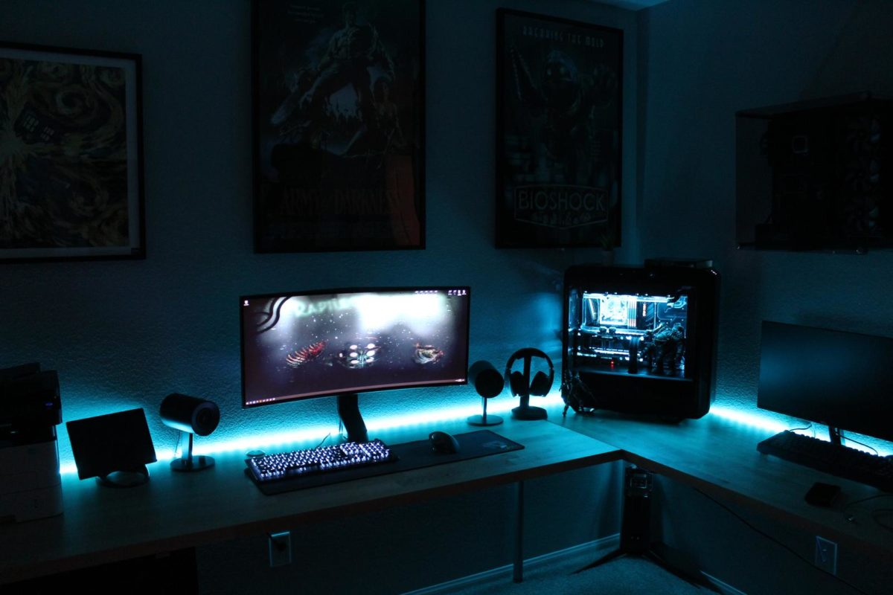

Hi there. I'm Yash Khare and this is my personal blog.
I write about machine learning, and my experiences.
This blog is open sourced on [GitHub](https://www.github.com/yashk2000/blog/),
feel free to submit corrections or use the code to create your own blog.

[Twitter](https://twitter.com/_p0lar_bear) | [GitHub](https://github.com/yashk2000) | [GitLab](https://gitlab.com/yashk2000) | [LinkedIn](https://www.linkedin.com/in/yashk2000/) | [Portfolio](https://yashk2000.github.io/) | [amFOSS](https://amfoss.in/@yashk2000/)

