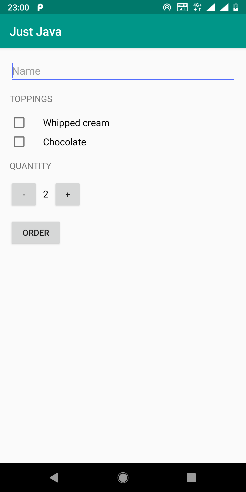
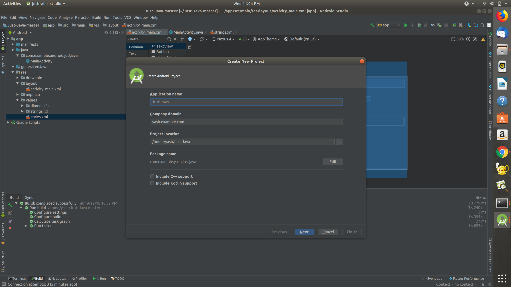
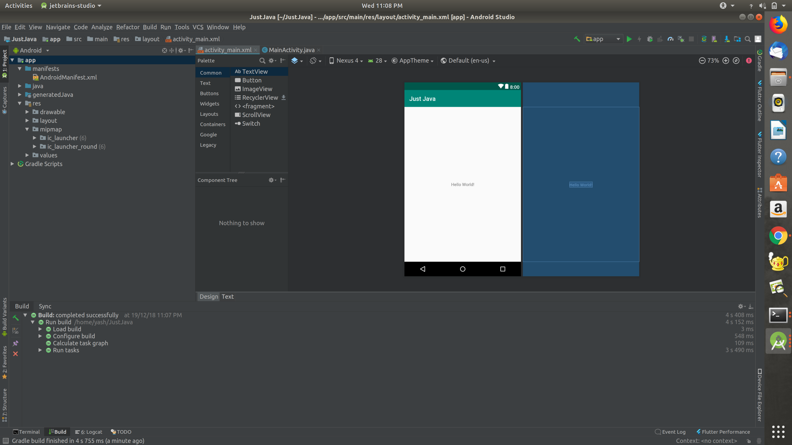
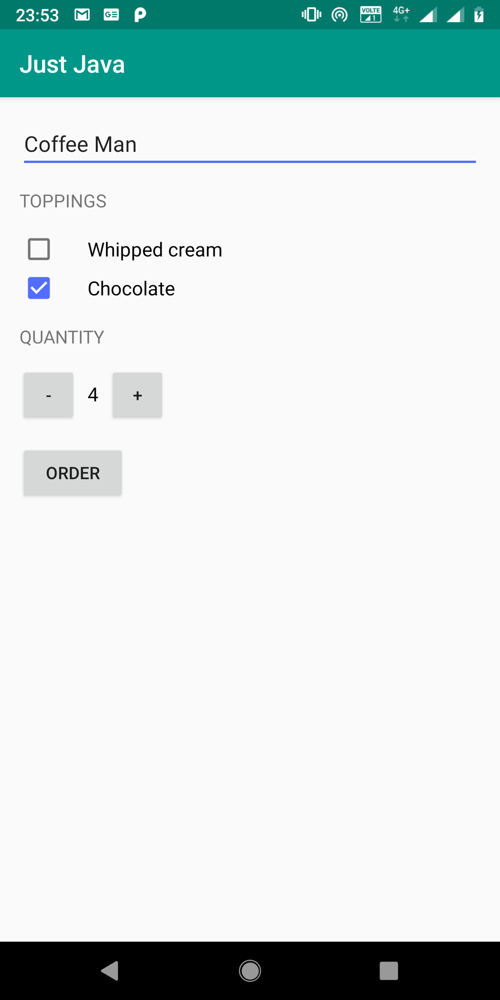
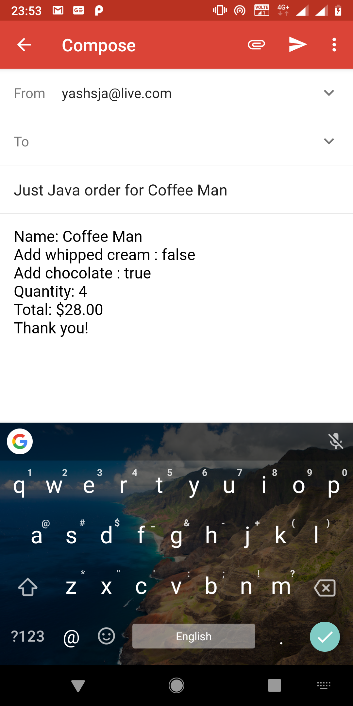

<center>


</center>

In this blog, I'll teach you how to make a simple coffee ordering app. You can enter the details of coffee in the app and then send it using e-mail to a shop. The app will finally look like:



To get started you need Android Studio installed in your computer and an Android phone to test the app on. If you don't have an android phone you can use the Android Studio emulators.

Let's start. First, you have to create a new Android Studio project.



Keep clicking next. When you are asked to chose an activity for your app, chose "Empty Activity". Then proceed further, click finish and you have a screen which looks like this:



This is the xml file. You can view the Text portion of the file by clicking on the Text button next to the design button. The xml file is basically the design file. All the different things that you see in an app are in the xml file. The function of the buttons and other views in an xml file are defined in Java classes. These Java classes are generally called activities.

The next step in building the app is designing it. You have to chose the view you want to use in the app. I have used relative layout because I have various different views which are placed below, to the left or to the right of other views, that is, placed relative to other views. Further, we can declare different layouts inside one layout. As you can see in the final look of the app, name topping and quantity are vertically arranged. So we can use a linear layout inside relative layout to make arranging them easier.

So let's start with the name. To enter the name, we use a view called "EditText". In this view, we can take input from the user. To declare the name  edit text we do:

```xml
<EditText
    android:id="@+id/name_field"
    android:layout_width="match_parent"
    android:layout_height="wrap_content"
    android:hint="@string/name"
    android:inputType="text" />
```

Next, we add the topping heading which is a simple TextView.

```xml
<TextView
    style="@style/HeaderTextStyle"
    android:text="@string/toppings" />
```

I have used a predefined style to stylize the toppings heading. You can declare these styles in the style directory of the res folder. The style I have used is:

```xml
<style name="HeaderTextStyle">
    <item name="android:layout_width">wrap_content</item>
    <item name="android:layout_height">48dp</item>
    <item name="android:gravity">center_vertical</item>
    <item name="android:textAllCaps">true</item> 
    <item name="android:textSize">15sp</item>
</style>
```

Next, we need to add the toppings checkboxes. For this we have a view called ChechBox. I will show you how to add the whipped cream checkbox. Then try to add the chocolate checkbox yourself.

```xml
<CheckBox 
    android:id="@+id/whipped_cream_checkbox" 
    android:layout_width="wrap_content" 
    android:layout_height="wrap_content" 
    android:paddingLeft="24dp" 
    android:text="@string/whipped_cream" 
    android:textSize="16sp" />
```

Now try to implement the chocolate checkbox yourself. To see how your design looks keep seeing the design tab of the xml file.

Now add the quantity text view in the same way that we added the toppings text view. This is the end of the first part of the layout. In this case, the linear layout was vertical. Now to set the buttons for the quantity we need a horizontal linear layout.

Declare another linear layout in which the orientation is horizontal. Then we have to set two buttons and a text view in between.

```xml
<Button
        android:layout_width="48dp"
        android:layout_height="48dp"
        android:onClick="decrement"
        android:text="-" />

    <TextView
        android:id="@+id/quantity_text_view"
        android:layout_width="wrap_content"
        android:layout_height="wrap_content"
        android:paddingLeft="8dp"
        android:paddingRight="8dp"
        android:text="@string/initial_quantity_value"
        android:textColor="@android:color/black"
        android:textSize="16sp" />

    <Button
        android:layout_width="48dp"
        android:layout_height="48dp"
        android:onClick="increment"
        android:text="+" />
```

Now your number buttons are also set, leaving us only with the order button. This is very easy, just declare a button view with the name order.

```xml
<Button 
    android:layout_width="wrap_content" 
    android:layout_height="wrap_content" 
    android:layout_marginTop="16dp" 
    android:onClick="submitOrder" 
    android:text="@string/order" />
```

So your xml file is done now. To help you I am giving the entire code of the xml here:

```xml
<RelativeLayout xmlns:android="http://schemas.android.com/apk/res/android"
    xmlns:tools="http://schemas.android.com/tools"
    android:layout_width="match_parent"
    android:layout_height="match_parent"
    tools:context=".MainActivity">

    <LinearLayout
        android:layout_width="match_parent"
        android:layout_height="match_parent"
        android:orientation="vertical"
        android:paddingLeft="@dimen/activity_horizontal_margin"
        android:paddingTop="@dimen/activity_vertical_margin"
        android:paddingRight="@dimen/activity_horizontal_margin"
        android:paddingBottom="@dimen/activity_vertical_margin">

        <EditText
            android:id="@+id/name_field"
            android:layout_width="match_parent"
            android:layout_height="wrap_content"
            android:hint="@string/name"
            android:inputType="text" />

        <TextView
            style="@style/HeaderTextStyle"
            android:text="@string/toppings" />

        <CheckBox
            android:id="@+id/whipped_cream_checkbox"
            android:layout_width="wrap_content"
            android:layout_height="wrap_content"
            android:paddingLeft="24dp"
            android:text="@string/whipped_cream"
            android:textSize="16sp" />

        <CheckBox
            android:id="@+id/chocolate_checkbox"
            android:layout_width="wrap_content"
            android:layout_height="wrap_content"
            android:paddingLeft="24dp"
            android:text="@string/chocolate"
            android:textSize="16sp" />

        <TextView
            style="@style/HeaderTextStyle"
            android:text="@string/quantity" />

        <LinearLayout
            android:layout_width="match_parent"
            android:layout_height="wrap_content"
            android:orientation="horizontal">

            <Button
                android:layout_width="48dp"
                android:layout_height="48dp"
                android:onClick="decrement"
                android:text="-" />

            <TextView
                android:id="@+id/quantity_text_view"
                android:layout_width="wrap_content"
                android:layout_height="wrap_content"
                android:paddingLeft="8dp"
                android:paddingRight="8dp"
                android:text="@string/initial_quantity_value"
                android:textColor="@android:color/black"
                android:textSize="16sp" />

            <Button
                android:layout_width="48dp"
                android:layout_height="48dp"
                android:onClick="increment"
                android:text="+" />
        </LinearLayout>

        <Button
            android:layout_width="wrap_content"
            android:layout_height="wrap_content"
            android:layout_marginTop="16dp"
            android:onClick="submitOrder"
            android:text="@string/order" />
    </LinearLayout>
</RelativeLayout>
```

Now, we come to the main part of the app, that is the MainActivity.java file. You set the layout of the file in the onCreate method.

```java
@Override
    protected void onCreate(Bundle savedInstanceState) {
        super.onCreate(savedInstanceState);
        setContentView(R.layout.activity_main);
    }
```

Then you need to add functions to increment and decrement the coffee cups, to control the '+' and '-' buttons. You also have to create a display method to display the quantity.

```java
private void displayQuantity(int numberOfCoffees) {
        TextView quantityTextView = (TextView) findViewById(R.id.quantity_text_view);
        quantityTextView.setText("" + numberOfCoffees);
}
```

Then you have to create a method to calculate the total price of the order and to send a mail. To send the mail, you will have to create a new intent. You can learn about intents [here](https://developer.android.com/guide/components/intents-filters). The button will know which method to call as we have defined their onClick parameters. The onClick parameters and the method name must be the same for the method to be executed.

So finally after creating all the methods your MainActivity. java will look like:

```java
package com.example.android.justjava;

import android.content.Intent;
import android.net.Uri;
import android.os.Bundle;
import android.support.v7.app.AppCompatActivity;
import android.text.Editable;
import android.view.View;
import android.widget.CheckBox;
import android.widget.EditText;
import android.widget.TextView;

import java.text.NumberFormat;

public class MainActivity extends AppCompatActivity {
    int quantity = 2;

    @Override
    protected void onCreate(Bundle savedInstanceState) {
        super.onCreate(savedInstanceState);
        setContentView(R.layout.activity_main);
    }

    public void increment(View view) {
        if (quantity == 100) {
            return;
        }
        quantity = quantity + 1;
        displayQuantity(quantity);
    }

    public void decrement(View view) {
        if (quantity == 0) {
            return;
        }
        quantity = quantity - 1;
        displayQuantity(quantity);
    }

    public void submitOrder(View view) {
        // Get user's name 
        EditText nameField = (EditText) findViewById(R.id.name_field);
        Editable nameEditable = nameField.getText();
        String name = nameEditable.toString();
        // if the user wants whipped cream topping
        CheckBox whippedCreamCheckBox = (CheckBox) findViewById(R.id.whipped_cream_checkbox);
        boolean hasWhippedCream = whippedCreamCheckBox.isChecked();
        // if the user wants choclate topping 
        CheckBox chocolateCheckBox = (CheckBox) findViewById(R.id.chocolate_checkbox);
        boolean hasChocolate = chocolateCheckBox.isChecked();
        // Calculate the price 
        int price = calculatePrice(hasWhippedCream, hasChocolate);
        // Display the order summary on the screen 
        String message = createOrderSummary(name, price, hasWhippedCream, hasChocolate);
        // Use an intent to launch an email app. 
        // Send the order summary in the email body.
        Intent intent = new Intent(Intent.ACTION_SENDTO);
        intent.setData(Uri.parse("mailto:")); // only email apps should handle this
        intent.putExtra(Intent.EXTRA_SUBJECT, getString(R.string.order_summary_email_subject, name));
        intent.putExtra(Intent.EXTRA_TEXT, message);
        if (intent.resolveActivity(getPackageManager()) != null) {
            startActivity(intent);
        }
    }

    private int calculatePrice(boolean addWhippedCream, boolean addChocolate) {
        // First calculate the price of one cup of coffee
        int basePrice = 5;
        // If the user wants whipped cream, add $1 per cup
        if (addWhippedCream) {
            basePrice = basePrice + 1;
        }
        // If the user wants chocolate, add $2 per cup 
        if (addChocolate) {
            basePrice = basePrice + 2;
        }
        // Calculate the total order price by multiplying by the quantity 
        return quantity * basePrice;
    }

    private String createOrderSummary(String name, int price, boolean addWhippedCream, boolean addChocolate) {
        String priceMessage = getString(R.string.order_summary_name, name);
        priceMessage += "\n" + getString(R.string.order_summary_whipped_cream, addWhippedCream);
        priceMessage += "\n" + getString(R.string.order_summary_chocolate, addChocolate);
        priceMessage += "\n" + getString(R.string.order_summary_quantity, quantity);
        priceMessage += "\n" + getString(R.string.order_summary_price, NumberFormat.getCurrencyInstance().format(price));
        priceMessage += "\n" + getString(R.string.thank_you);
        return priceMessage;
    }

    private void displayQuantity(int numberOfCoffees) {
        TextView quantityTextView = (TextView) findViewById(R.id.quantity_text_view);
        quantityTextView.setText("" + numberOfCoffees);
    }
}
```

Congratulations!! You just made an app to order coffee. Now build the app and test it on an Android device or Emulator. When you click the order button, a mail is opened.





Thank you for reading the blog. Hope you liked it!! All the best in making bigger and better apps.