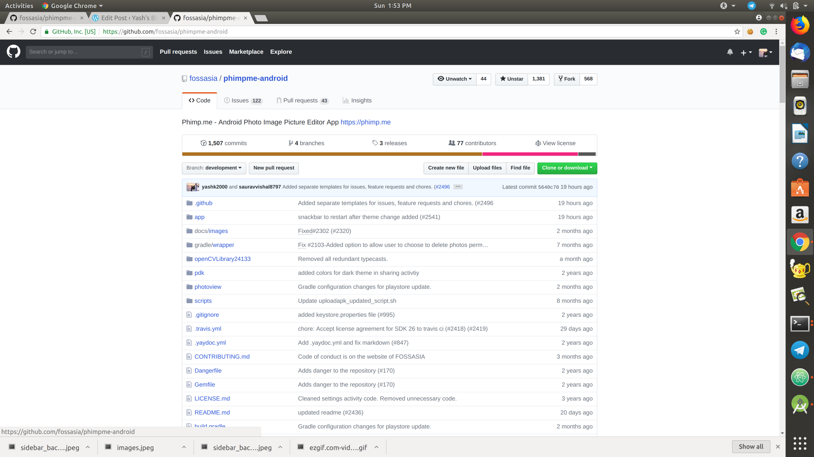
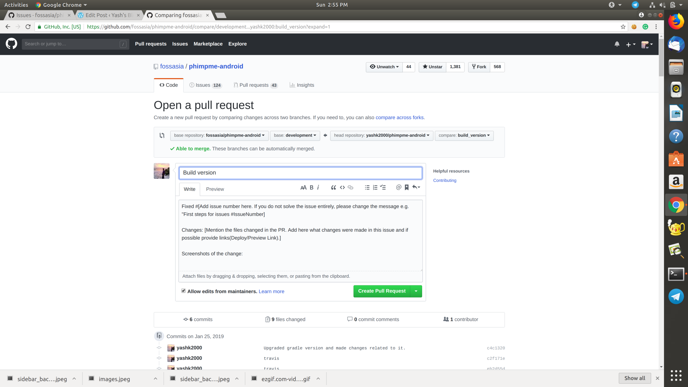

<center>


</center>


In the previous blog post, I have explained what git is and some basic commands. In this post, I will tell you how to send a pull request along with all the proper practices that should be followed while doing so.

The first thing to do while contributing is to fork and clone the repository which you are working on. You can easily fork a repository from GitHub itself by clicking on the fork option on the top right corner.



After forking, you have your own copy of the repository which will be by the name: "your GitHub user name"/"project name". Now you have to clone the repo to your computer in order to make changes. This can be done by pressing the green button in the right corner towards the top, "Clone or Download". Click on it. It will give you a link. Copy the link to clipboard and then clone the repository. This is done by using git clone in the terminal.

```bash
git clone "the link you copied"
```

This will create a local copy of the repository to make all the changes you want. Now we will start with the main parts, what to do before, while sending and after sending the pull request.

**Part 1:**

The first thing to do before making any change is checking out to a new branch, i.e. creating a new branch. The reason to do this is so that your main branch remains intact and no changes happen to it. So in case, something goes wrong in the other branch, you can always go back to the same code as in the main branch. Also if you make changes directly to the main branch, you will have to wait to make more changes until the current change you sent is merged(merging will be discussed later in this post).

So how to create a new branch? There is a simple command called "checkout".

```bash
git checkout -b "name of new branch"
```

`b` is the extension used to tell git that you want to shift to a new branch. If you have to shift to an already existing branch, do:

```bash
git checkout "branch name"
```

Now if you have created a new branch successfully, make the change that you wanted to.

**Part 2:**

Now comes the part while you are making changes. Sometimes while making changes, you might want to shift to another branch. But of the changes you have made to your branch haven't been saved, you won't be able to checkout to another branch. In this case, you will have to do a forced checkout, but this will cause the changes in your branch to appear in the brach you checkout to also. Here I will tell you about another keyword which is really useful- "stash".

As the keyword suggests, you stash the changes and can use them later. To stash the changes you want, simply do:

```bash
git stash
```

Now you can checkout to any branch safely. Then comes the question of how to restore the changes you had stashed when you want to work on them again. This can be done simply by using:

```bash
git stash apply
```

This will unstash the latest changes you stashed. If you have stashed changes multiple times, you can see all the stashes by doing:

```bash
git stash list
```

You can then choose the change you want to restore by doing:

```bash
git stash apply "name of the stash as shown in the stash list"
```

So this will cover any difficulties you might face while making a change.

**Part 3:**

Now you have made the change and the only thing left to do is pushing the change to GitHub. This again has a really simple command, "push". But before doing this, you have to add, commit the changes and then push them.

So the first thing to do is to compare the changes you have made with the original code. This is done by doing:

```bash
git diff
```

After doing this, you can see all the changes you have made. If you are satisfied with the changes made, proceed to the next step. Now do:

```bash
git status
```

This will give you a summary of files changed, added or deleted. You have to add all these changes to git which is done by doing:

```bash
git add .
```

Once the changes have been added, you can finally commit them by doing:

```bash
git commit
```

Now you can again to git status to see the changes committed. It will give you the number of commits made and the difference between your branch and the main branch. Now finally the changes you made are ready to be pushed. To do this simply type:

```bash
git push 
```

And you are done now. Congratulations!! you have fixed an issue and pushed it. Now you just have to open a pull request. This can again be done directly from GitHub.

Go to your forked repository. Choose your branch and press on create pull request.




And you're done. You've sent a pull request.

**Some miscellaneous things:**

Now there are some other things which you might need sometimes. These include resetting, squashing and managing remotes.

**Resetting:** Sometimes, you might make some unintentional changes and you might not be able to reverse them no matter what you try. In this case, you can reset your branch to be exactly the same as the remote main branch. (you need to have a git remote setup for this. It will be discussed ahead) So simply do `git reset --hard "main brach name"` . Now your branch is exactly the same as your main branch and you can continue making changes.

**Squashing:** Sometimes after making a pull request, or after pushing your change, you might think of something that you forgot to do. You will make the change, and push the change again. This will result in another commit. Having multiple commits on a single pull request is not a good practice. So you have to squash all the commits into one. This is done by: `git rebase -i HEAD~"number of commits to be squashed"`. After doing this, a menu opens in the terminal. In it, replace all the "pick" with "squash" except the first one. Then you can set up the commit messages. And you're done. The commits have been squashed. Now you'll have to do a force push to make the changes appear on GitHub. Do: `git push -f`.

**Managing remotes:** The remote is the original repository from which you forked your repository. You need to manage remotes in order to keep your own repository up to date with what is happening in the original repo. You can check your remotes by doing `git remote -v`. This will show you your own upstream branches as well as remotes if you have them. If you do not have remote, you can add remotes by doing `git remote add upstream "clone link of the original repsository"`. Now, whenever you have to update your repository to make it the same as the original one simply fetch and pull the changes by doing: `git fetch upstream "branch name"` and then `git pull upstream "branch name"`.

So these are the basics of git. Now you can send a pull request yourself. Also, the techniques used here for squashing, creating a new branch etc. are just one of the many methods available in git to do those things. I have tried to put the simplest ways here for your convenience. You can try making your first contribution [over here](https://github.com/firstcontributions/first-contributions). Then you can try choosing an open source project which interests you, see issues and start working on them. Good luck contributing!!