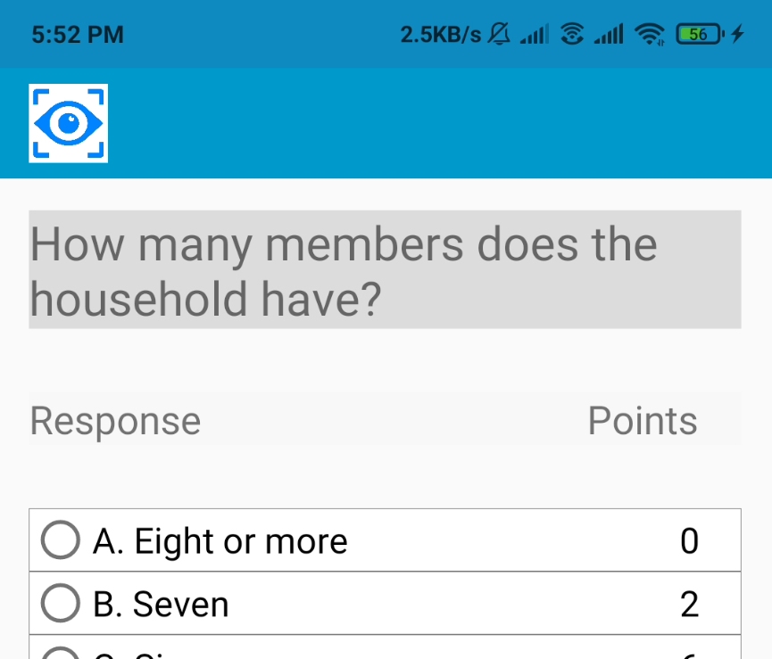
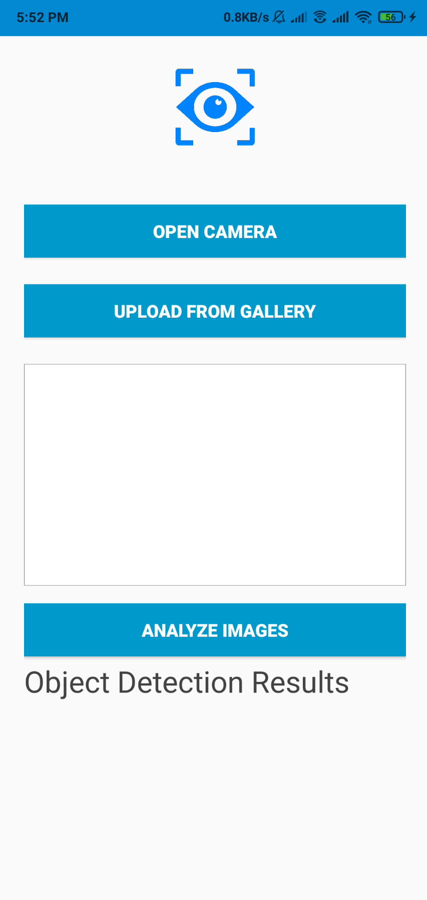
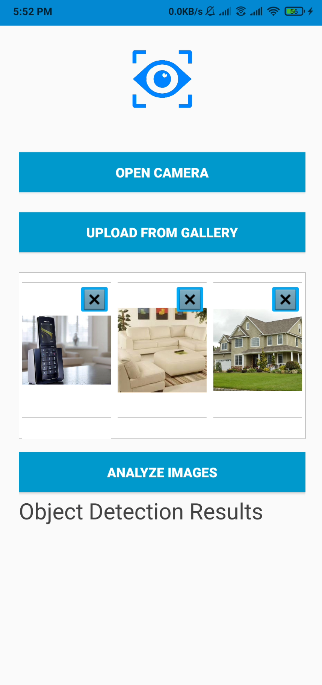

This blog post marks the end of the secons coding period of GSoC 2020 which I passed successfully 🔥

During this phase, my work involved making the system for detecting all kinds of objects in an image. Once this work is done, in the phase 3 I would be working in automating
the process of filling the survey using results from my work done in phase 2. 

So the first step was to provide a way to enter the `ComputerVisionActivity.kt` from the survey for analysing the images. This work was simple enough. I just integrated 
a button enter the activity in the toolbar of the `PPISurveyActivity.kt`. Putting it in the toolbar made it accessible from all the question fragments that wouls be 
displayed. This work was done by the tiny [PR #145](https://github.com/openMF/ppi-vision/pull/145).

The next step was to get onto the actual object detection part. Some work on this had been done during the past GSoC in 2019. The method used then was utilising the
Google Cloud Vision Platform. The work in this case would involve the following steps:

- Collect data
- Make a labelled dataset and upload to the Google Cloud Platform
- Cloud Vision will automatically train a model to label all objects present in an image
- Utilize the Cloud Vision APIs to send requests to Google Cloud and get back the results

But there are a few cons to this method. The cons include: 

- Google Cloud Vision is payed and would cost more than a 1000$ per month just to keep the model deployed 😑
- The initial training phase would also cost quite a bit of money 😕
- There would be some latency in getting results back since data has to be uploaded, analysed and returned. The speed of this process would entirely depend on the 
connection speed of the user ⏰

So I had a discussion with with my mentor, Nayan and the org admin of Mifos, Ed. I proposed to go ahead with Google's MLKit SDK. MLKit was earlier provided as a Firebase
service. But a couple of months ago, Google made MLKit a stand-alone completely offline SDK with which one can either use or not use Firebase. We analysed both the
options of Cloud Vision and MLKit. In the end, we decided to go ahead with MLKit as it had the following pros:

- No payment needed at all 🤑   
- No latency as network connection isn't needed 🚫
- No cost in training the model or re-training it 💲
- Models can be trained using transfer leanring with TensorFlow and then be converted into tflite models 📱

So I worked on implementing the MLKit object detection feature in the application. Initially, I integrated it using Firbase for testing purposes. All of this work can be 
in [PR #148](https://github.com/openMF/ppi-vision/pull/148). 

Later, I looked more into MLKit and came up with a smaller and more efficient method. I also worked on making a UI for displaying the results of image labelling. 
I also completely removed any dependency on google-services and Firebase. The work for this can be found in [PR #151](https://github.com/openMF/ppi-vision/pull/151)
and [PR #153](https://github.com/openMF/ppi-vision/pull/153).

|   |    |
|------------------|------------------|
| Computer Vision Activity Empty |  Images Uploaded from Gallery |

A gif of how the entire process looks like: 

    

So this was most of the work I did for my phase 2 of GSoC. We'll enter the next and final phase tomorrow 🎆

