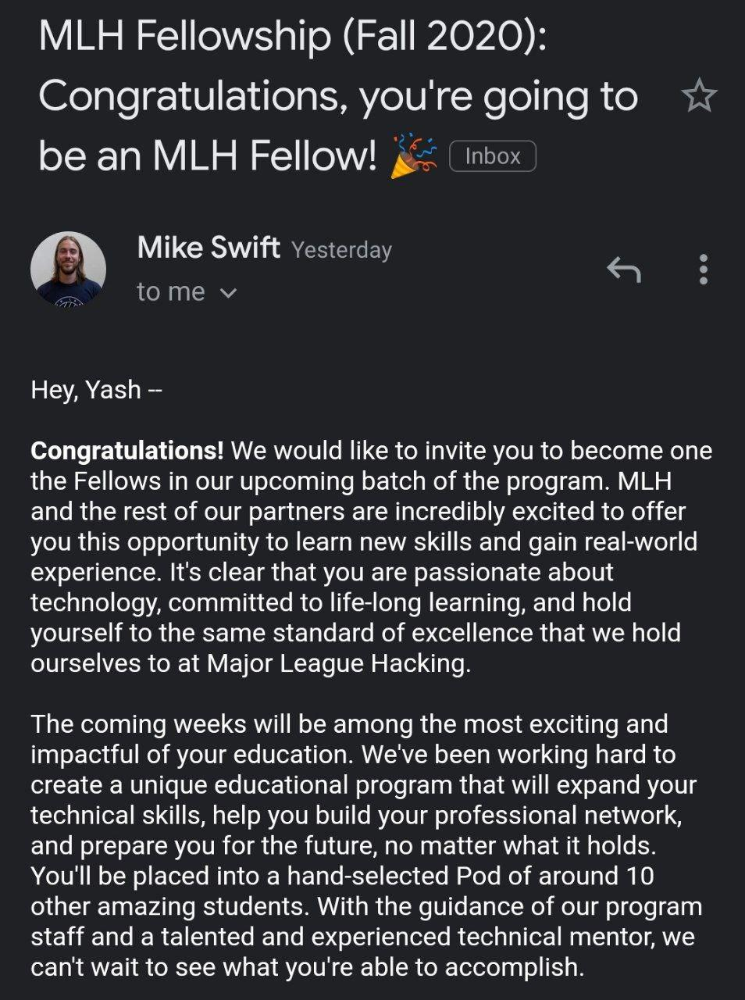

I got selected for the Fall 2020 session of the MLH Fellowship!!🎉🥳

The MLH Fellowship is a 12-week internship alternative. The program pairs fun, and educational curriculum with practical experience. The program is collaborative, 
remote, and happens under the guidance of expert mentors. I had applied for the Explorer track of the program. The MLH Explorer Fellowship is a 12 week internship
alternative where selected students build out a portfolio of projects & experiment with new technologies by collaborating in small groups on a series of short hackathon
sprints 💻

The first step after submitting an application is to give 2 interviews. The first interview is for MLH to know how well suited is an applicant for the program. My first 
interview happened on 12th September. My interviewer was [Manya Agarwal](https://twitter.com/manya_ag). The interview was really smooth and the interviewer was very 
friendly as well. The first interview went pretty well and I got the notification to setup a time for the second interview that night itself 🌃

I scheduled my second interview on 14th September. The second interview is a coding interview in which the interviewer asks in depth questions from the code sample
submitted during the application process. I had submitted [this](https://github.com/Fireboltz/Paneeer) project on which I was interviewed. This time my interviewer was
[Aaron Osher](https://twitter.com/aaronosher). The interview went fine this time too and again it was a very smooth and friendly process. After this I just had to sit tight
for a few days before I got the result of my interview and final selection status. I was sitting restlessly the next two days till I got the final email with the results 😬 
On 16th September I got an email saying that I was accepted for the program. This was great news for me and I was ecstatic on seeing the email 🤪

The program officially kicked off on 21st September when we had the first pod meeting where I was introduced to all the other members in my pod. We had the great chance to be
able to interact with Mike Swift himself during the kick off 🔥🔥

You'll be wondering what a pod is. So a pod is basically a group of around 10-12 students who work together throughout the period of the fellowship. We have a pod leader as well 
as a few mentors dedicated to our pod to help us out with anything we need. I have one of the most amazing pod leaders, [Karan Sheth](https://www.linkedin.com/in/kiteretsu).

We had a great time during the kick off and got to know most of the other pod members, as well as started off with our first hackathon sprint. All of us pod members are
divided into 4 teams of 3 for each sprint. Since this is the first sprint, it is an open ended theme and tech stack. From the next sprint, there will be specific tech stacks as well as 
themes for each sprint 😎

For the first hackathon sprint I got teamed up with 2 other amazing people, [Shambhavi](https://github.com/agg-shambhavi) and [Harsh](https://github.com/HarshCasper) 💯
The work is already underway and I'll describe our idea and the project in my next post once we're done!😃