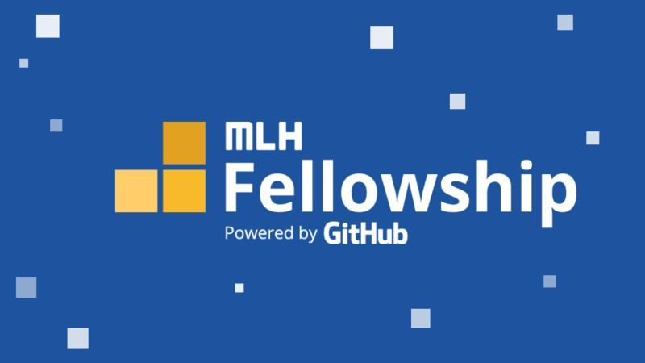

The first hackthon sprint of the MLH Fellowship's first explorer track got over! It was an amazing two weeks working on a project
and building a fully fledged app📱

So my team members were [Shambhavi](https://github.com/agg-shambhavi) and [Harsh](https://github.com/HarshCasper). It was 
an awesome experince working with both of them. Even thought we don't know each other and have never met, we were able to work 
like a real team. We had a lot of fun collaborating and having late night debugging sessions on Google Meet with music playing
in the background 🎸

Our idea was to make an application to help visually impaired people in perceiving the world around them 
in a better way by using the camera on their mobile phones.

For an MVP we planned to add the following features: 

- Live image captioning 📸
- Image Labelling 🖼
- OCR 🅰
- Currency Detection 💲
- SOS 🆘

Surprisingly we were able to implement all of these features that we planned within the given time period. Shambhavi and I moslty
worked on the flutter application. Harsh worked on the image captioning backend. We actually developed 2 backends for the image
captioning. One of the backends was developed from scratch by us, but the model was too heavy to be hosted on platforms like 
Heroku. So we made a python wrapper over CaptionBot which uses the Microsoft Cognitive APIs, and used that in our app. 

**How our project is more accessible for visually impaired people**

- Every feature, from image labeling to currency detection uses a text-to-speech feature to speak out to the user whatever is detected 🗣️
- Each screen vibrates with different intensity on being opened helping to user navigate. The buttons also have unique vibrations for better accessibility 📳
- We have used a minimum number of buttons, but whichever buttons are there, are of a large size. For instance, the top half
of the screen will be one button, and the bottom half, another button so that a user does not need to precisely click on a 
particular position 🔘
- All features, except the image captioning feature, work completely offline and do not require any internet connection 📶 
- All offline features work in real-time and do not need any pre-processing time for the models to make predictions so the
user can get instant updates 🚗

We submitted the project and then waited for the results which were to be announced on 9 October 2020. 

We had the biggest surprise waiting for us that day. We won 🤯🥳

It was an awesome experince, especially winning the first sprint. 

You can find the link to our project over here:

- Project: [https://github.com/HarshCasper/HelpingHand](https://github.com/HarshCasper/HelpingHand)
- Devpost Submission: [https://devpost.com/software/helpinghand-n8me97](https://devpost.com/software/helpinghand-n8me97)