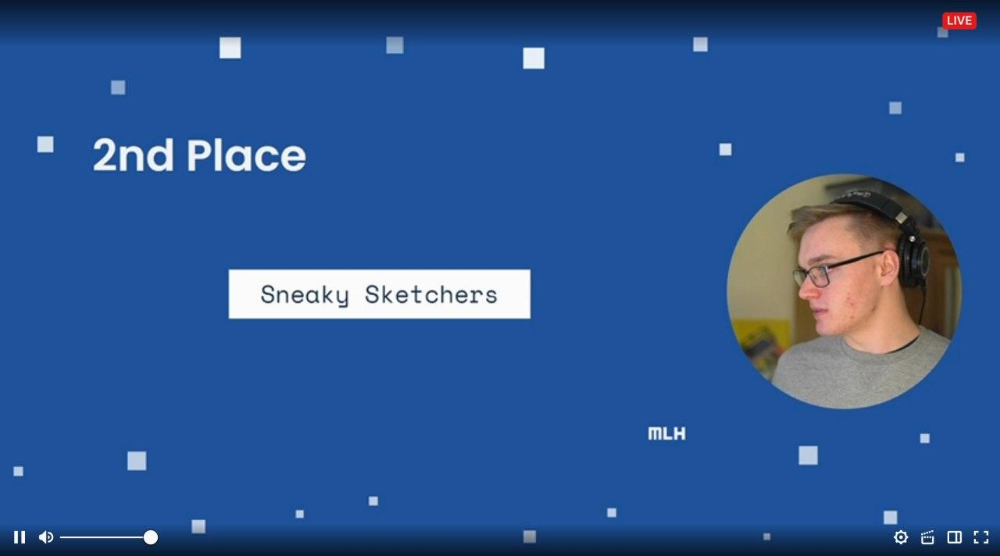

So we're done with the 4th sprint of the MLH Fellowship. This time the theme was ML/AI/Data Science. So what did we build?

## 🖼️ Sneaky Sketchers

### 🙋 What is Sneaky Sketchers?

Have you ever taken a photo in which there is some unneeded object in the background, ever taken a photo and someone just walked behind you, and now you feel the photo is not as good as it could have been? 📷 

If so, worry not! This desktop application allows you to select the areas in a photo you want to remove by drawing on them. Once you're done, the app will erase the objects you drew on, and generate a new photo which would look as if those obejcts were never present! 🔥

You can also use this application for having some fun. Ever wondered how you would look without a moustache, or with spectacles? Or wondered how your face would like with different features? Well draw over your face, and let the app do the magic! 👦 👧

### 💻 What did we use?
Sneaky Sketchers is built completely in [Python](https://www.python.org/). We have created [Jupyter Notebooks](https://jupyter.org/) on [Google Colab](https://colab.research.google.com/) to train our models and the desktop app is built using [PyQt5](https://pypi.org/project/PyQt5/) 🐍

### Installation 

For setting up the desktop app, head over [here](https://github.com/yashk2000/SneakySketchers/tree/main/application).

### Video instructions for using the application 🎥

Click on the image below to view a video of how to use the application. 

    <a href="https://youtu.be/yhbVQI32spE"></img>
    </a>

### 🪜 Folder Struture 

Each folder has it's own dedicated readme on what it's contents do, how to set them up and use them. 

- [`InPainting Notebook`](https://github.com/yashk2000/SneakySketchers/tree/main/InPainting%20Notebook): This folder contains the jupyter notebook we trained on Google Colab. 
- [`application`](https://github.com/yashk2000/SneakySketchers/tree/main/application): This folder contains the main PyQt5 desktop application.  
- [`inpainting`](https://github.com/yashk2000/SneakySketchers/tree/main/inpainting): This folder contains python scripts that can be used for training a model, or making predictions. They can directly be imported into your own project. 

### Model Architechture

We have used the technique for **partial convolutions** for performing image inpainting and training the model. This is a PyTorch implementation of "Image Inpainting for Irregular Holes Using Partial Convolutions", [https://arxiv.org/abs/1804.07723](https://arxiv.org/abs/1804.07723)
by Guilin Liu, Fitsum A. Reda, Kevin J. Shih, Ting-Chun Wang, Andrew Tao and Bryan Catanzaro from NVIDIA. 

**Partial Convolution Layer**

The key element here is ofcourse the partial convolutional layer. Basically, given the convolutional filter **W** and the corresponding bias *b*, the following partial convolution is applied instead of a normal convolution:

where ⊙ is element-wise multiplication and **M** is a binary mask of 0s and 1s. Importantly, after each partial convolution, the mask is also updated, so that if the convolution was able to condition its output on at least one valid input, then the mask is removed at that location, i.e.

The result of this is that with a sufficiently deep network, the mask will eventually be all ones (i.e. disappear)

### UNet Architecture
The architechture essentially it's based on a UNet-like structure, where all normal convolutional layers are replace with partial convolutional layers, such that in all cases the image is passed through the network alongside the mask.

**The loss function**

This technique uses quite an intense loss function. The highlights of it are:

* Per-pixel losses both for maskes and un-masked regions
* Perceptual loss based on ImageNet pre-trained VGG-16 (*pool1, pool2 and pool3 layers*)
* Style loss on VGG-16 features both for predicted image and for computed image (non-hole pixel set to ground truth)
* Total variation loss for a 1-pixel dilation of the hole region

The weighting of all these loss terms are as follows:

**VGG16 model for feature extraction**

The authors of the paper used PyTorch to implement the model. The VGG16 model was chosen for feature extraction. The [VGG16 model in PyTorch](https://pytorch.org/docs/stable/torchvision/models.html) was trained with the following image pre-processing:
1. Divide the image by 255,
2. Subtract [0.485, 0.456, 0.406] from the RGB channels, respectively,
3. Divide the RGB channels by [0.229, 0.224, 0.225], respectively.

### 🕒 Training Time

The paper which we referred to has trained the model on 3 different datasets, for a period of 14 days. Where as with the resources we had(thanks to Google Colab), we just trained our model on a subset of the Places2 dataset for one night. Based on this limited amount of training, the model does not match the performance given by the original implementation, but it does a pretty good job. In future, should we get the time and resources to train the model completely, we would be able to improve our model a lot.  

Our model can be downloaded from [here](https://drive.google.com/file/d/1_J-NgecLjU9PDvkmnJAo7-ghcQuqia2N/view?usp=sharing).

### 📷 How the desktop app looks 

|  |   |
|---|---|
| PyQt App | Loading an image |
|  |  |
| Original | Inpainted |
|   |  |
| Original | Inpainted |
|  |  |
| Original | Inpainted |

### What's next? 

- A web version of the application with a lighter model. 
- A better UI for the desktop app
- Training the model further to improve it's performance. 

### 📜 License
This project is released under a free and open-source software license, Apache License 2.0 or later ([LICENSE](LICENSE) or https://www.apache.org/licenses/LICENSE-2.0). The documentation is also released under a free documentation license, namely the [GFDL v1.3](https://www.gnu.org/licenses/fdl-1.3.en.html) license or later.

### 🖊️ Contributions
Unless you explicitly state otherwise, any contribution intentionally submitted for inclusion in the work by you, as defined in the Apache-2.0 license, shall be licensed as above, without any additional terms or conditions.

### Resources 

- [https://github.com/MathiasGruber/PConv-Keras](https://github.com/MathiasGruber/PConv-Keras)
- "Image Inpainting for Irregular Holes Using Partial Convolutions", [https://arxiv.org/abs/1804.07723](https://arxiv.org/abs/1804.07723)

### Results 💀

2 weeks later, we had the twitch live stream and got the results. Our team came second in the global finale! 🔥🔥

### Project link 📶

If you are interest in checking out the project, you can checkout the follwing links:

- GitHub repo: [https://github.com/yashk2000/SneakySketchers](https://github.com/yashk2000/SneakySketchers)
- For contributors: [https://github.com/yashk2000/SneakySketchers#man_technologist-how-do-i-contribute](https://github.com/yashk2000/SneakySketchers#man_technologist-how-do-i-contribute)