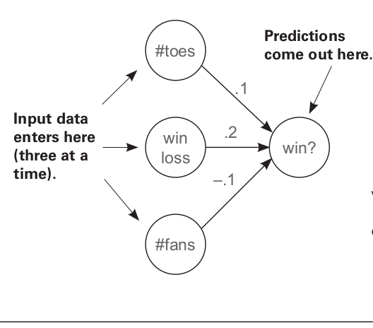
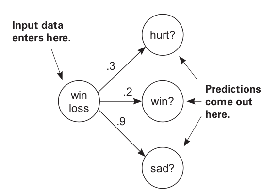
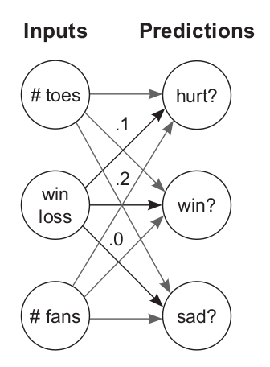

<center>


</center>

So in the last blog we saw how gradient descent works and all the parameters involved with it. Now let’s go a bit deeper into this, and see how we can use gradient descent with multiple inputs and outputs, since most real world data will not just have a single set of inputs  and a single output to be predicted. 

### Generalizing gradient descent for multiple inputs 

Let’s start with the first step, generalizing gradient descent for multiple inputs. 

```python
def neural_network(input, weights):
  out = 0
  for i in range(len(input)):
    out += (input[i] * weights[i])
  return out

def ele_mul(scalar, vector):
  out = [0,0,0]
  for i in range(len(out)):
    out[i] = vector[i] * scalar
  return out

toes =  [8.5, 9.5, 9.9, 9.0]
wlrec = [0.65, 0.8, 0.8, 0.9]
nfans = [1.2, 1.3, 0.5, 1.0]

win_or_lose_binary = [1, 1, 0, 1]

alpha = 0.01
weights = [0.1, 0.2, -.1]

for i in range(4):

	print("-----------------------")
	print()
	print("Input:" + str(i+1))
	print()
	
	input = [toes[i],wlrec[i],nfans[i]]
	true = win_or_lose_binary[i]

	for iter in range(3):

	  pred = neural_network(input,weights)

	  error = (pred - true) ** 2
	  delta = pred - true

	  weight_deltas=ele_mul(delta,input)

	  print("Iteration:" + str(iter+1))
	  print("Pred:" + str(pred))
	  print("Error:" + str(error))
	  print("Delta:" + str(delta))
	  print("Weights:" + str(weights))
	  print("Weight_Deltas:")
	  print(str(weight_deltas))
	  print(
	  )

	  for i in range(len(weights)):
	    weights[i]-=alpha*weight_deltas[i]
```

Output:

```bash
-----------------------

Input:1

Iteration:1
Pred:0.8600000000000001
Error:0.01959999999999997
Delta:-0.1399999999999999
Weights:[0.1, 0.2, -0.1]
Weight_Deltas:
[-1.189999999999999, -0.09099999999999994, -0.16799999999999987]

Iteration:2
Pred:0.9637574999999999
Error:0.0013135188062500048
Delta:-0.036242500000000066
Weights:[0.1119, 0.20091, -0.09832]
Weight_Deltas:
[-0.30806125000000056, -0.023557625000000044, -0.04349100000000008]
.
.
.
-----------------------

Input:4

Iteration:1
Pred:-0.024454666387999924
Error:1.049507363484148
Delta:-1.0244546663879999
Weights:[-0.010114174845212006, 0.19098676821190194, -0.10531518417180363]
Weight_Deltas:
[-9.220091997491998, -0.9220091997491999, -1.0244546663879999]

Iteration:2
Pred:0.8238962428479027
Error:0.031012533283084842
Delta:-0.17610375715209725
Weights:[0.08208674512970798, 0.20020686020939393, -0.09507063750792363]
Weight_Deltas:
[-1.5849338143688754, -0.15849338143688754, -0.17610375715209725]

Iteration:3
Pred:0.9697277641455544
Error:0.0009164082636271821
Delta:-0.030272235854445606
Weights:[0.09793608327339673, 0.20179179402376282, -0.09330959993640266]
Weight_Deltas:
[-0.27245012269001045, -0.027245012269001046, -0.030272235854445606]
```

In this as you can see we have a set of 3 inputs, `toes`, `wlrec`, and `nfans`. We have an array of weights consisting of 3 elements. Each element is a weight corresponding to one of the inputs. 

Then we have started a training loop covering all the inputs. The network is trained on each input 3 times. In each iteration the following steps happen: 
The function `neural_network` is called, and our `input` array with one input of each kind is passed to the function along with the `weights` array to be trained. In the function we simply multiply each input with the corresponding weight and return the predictions. 
Next, we calculate our error by subtracting the `pred`, array of predictions from the `true` variable which gets the truth value for each cycle from `win_or_lose_binary`. Next we find out the `delta` as well. 
Finally we need to calculate the `weight_deltas` by doing element multiplication of each delta with the corresponding weight. 
Now we can update our weights which is done by the final for loop, along with taking into consideration, `alpha`, our learning rate which will help us prevent overshoot. 


Three inputs together determine what the final prediction will be. 

**A small recap**

**What is `delta`?**

Delta is a measure of how much higher or lower we want a node’s value to be to make a better prediction next time. 

**What is weight_delta?**

Weight delta is a derivative based estimate of how much to change the weight by. In addition to what delta does, weight_delta, also takes into consideration the direction in which to update the weight(increase or decrease it), accounting for scaling of weights since some weights might have more impact on the training than others. 

### Generalizing gradient descent for multiple outputs

This is the second step in our quest to find out how to train a network on multiple inputs and get multiple outputs at the same time. 

```python
weights = [0.3, 0.2, 0.9] 

def neural_network(input, weights):
	pred = ele_mul(input,weights)
	return pred
    
def ele_mul(scalar, vector):
	out = [0,0,0]
	for i in range(len(out)):
		out[i] = vector[i] * scalar
	return out

def scalar_ele_mul(number,vector,i):
	output = [0,0,0]

	assert(len(output) == len(vector))

	for i in range(len(vector)):
		output[i] = number * vector[i]

	return output

wlrec = [0.65, 1.0, 1.0, 0.9]

hurt  = [0.1, 0.0, 0.0, 0.1]
win   = [  1,   1,   0,   1]
sad   = [0.1, 0.0, 0.1, 0.2]

for i in range(4):

	input = wlrec[i]
	true = [hurt[i], win[i], sad[i]]

	pred = neural_network(input,weights)

	error = [0, 0, 0] 
	delta = [0, 0, 0]

	for j in range(len(true)):
		error[j] = (pred[j] - true[j]) ** 2
		delta[j] = pred[j] - true[j]

	weight_deltas = scalar_ele_mul(input,delta,j)

	alpha = 0.1

	for k in range(len(weights)):
		weights[k] -= (weight_deltas[k] * alpha)
	    
	print("--------------------------------------")
	print()
	print("Input " + str(i + 1))
	print()
	print("Weights:" + str(weights))
	print("Weight Deltas:" + str(weight_deltas))
```

Output: 

```bash
--------------------------------------

Input 1

Weights:[0.293825, 0.25655, 0.868475]
Weight Deltas:[0.061750000000000006, -0.5655, 0.3152500000000001]
--------------------------------------

Input 2

Weights:[0.2644425, 0.330895, 0.7816275]
Weight Deltas:[0.293825, -0.7434499999999999, 0.868475]
--------------------------------------

Input 3

Weights:[0.23799825000000002, 0.2978055, 0.71346475]
Weight Deltas:[0.2644425, 0.330895, 0.6816275]
--------------------------------------

Input 4

Weights:[0.22772039175000003, 0.3636832545, 0.6736741052499999]
Weight Deltas:[0.10277858250000002, -0.658777545, 0.3979064475]
```

Similar to the case with multiple inputs, now we take into consideration a single input with which we get multiple outputs. Here we are using 3 sets of weights to calculate the probabilities of three different outcomes: winning, being hurt or being sad. 

Let’s just take a brief look at the steps over here: 
We have just 1 input parameter, `wlrec`
We have 3 outputs to be predicted, `hurt`, `win`, and `sad`.
We have an array of `weights` with 3 elements, each weight for calculating the outcome of 1 event. 
We run a loop to go through all the inputs, and do all steps similar to what we did in the case when we were generating a single output with multiple inputs. 
In the end we print a set of `weights` and `weight_deltas` for each input. Each output is a list of 3 elements, the respective `weight` and `weight_delta` for each output. 



Single input, multiple outputs

### Generalizing Gradient Descent for multiple inputs and multiple outputs

Now we can finally get to our end goal. 

```python
import numpy as np

#toes %win #fans
weights = [ [0.1, 0.1, -0.3],#hurt?
            [0.1, 0.2, 0.0], #win?
            [0.0, 1.3, 0.1] ]#sad?

def w_sum(a,b):
    assert(len(a) == len(b))
    output = 0

    for i in range(len(a)):
        output += (a[i] * b[i])

    return output

def vect_mat_mul(vect,matrix):
	assert(len(vect) == len(matrix))
	output = [0,0,0]
	for i in range(len(vect)):
		output[i] = w_sum(vect,matrix[i])
	return output

def neural_network(input, weights):
	pred = vect_mat_mul(input,weights)
	return pred
    
def outer_prod(a, b):
	out = np.zeros((len(a), len(b)))
	for i in range(len(a)):
		for j in range(len(b)):
			out[i][j] = a[i] * b[j]
	return out

toes  = [8.5, 9.5, 9.9, 9.0]
wlrec = [0.65,0.8, 0.8, 0.9]
nfans = [1.2, 1.3, 0.5, 1.0]

hurt  = [0.1, 0.0, 0.0, 0.1]
win   = [  1,   1,   0,   1]
sad   = [0.1, 0.0, 0.1, 0.2]

alpha = 0.01

for i in range(4):
	input = [toes[i],wlrec[i],nfans[i]]
	true  = [hurt[i], win[i], sad[i]]

	pred = neural_network(input,weights)

	error = [0, 0, 0] 
	delta = [0, 0, 0]

	for j in range(len(true)):
		error[j] = (pred[j] - true[j]) ** 2
		delta[j] = pred[j] - true[j]
		
	weight_deltas = outer_prod(input,delta)
	
	for k in range(len(weights)):
		for l in range(len(weights[0])):
			weights[k][l] -= alpha * weight_deltas[k][l]
	
		
	print("------------------------------------")
	print()
	print("Iteration:" + str(i+1))
	print()
	print("Pred:" + str(pred))
	print("Error:" + str(error))
	print("Delta:" + str(delta))
	print("Weights:" + str(weights))
	print("Weight_Deltas:")
	print(str(weight_deltas))
```

Output: 

```bash
------------------------------------

Iteration:1

Pred:[0.555, 0.9800000000000001, 0.9650000000000001]
Error:[0.20702500000000007, 0.0003999999999999963, 0.7482250000000001]
Delta:[0.45500000000000007, -0.019999999999999907, 0.8650000000000001]
Weights:[[0.061325, 0.1017, -0.373525], [0.0970425, 0.20013, -0.005622500000000002], [-0.0054600000000000004, 1.30024, 0.08962]]
Weight_Deltas:
[[ 3.8675  -0.17     7.3525 ]
 [ 0.29575 -0.013    0.56225]
 [ 0.546   -0.024    1.038  ]]
.
.
.
```

So here we just combined what we were doing earlier into a single program. All the steps are exactly the same. Except now our weight matrix has a total of 3 sets of weights for each input, as well as for each output. 

```python
#toes %win #fans
weights = [ [0.1, 0.1, -0.3],#hurt?
            [0.1, 0.2, 0.0], #win?
            [0.0, 1.3, 0.1] ]#sad?
```

Here I have run each iteration just once in order to keep the program concise, but if you put the iteration in a loop as well, you can observe the changes to error and see that it keeps decreasing. 

This is how we use gradient descent on multiple inputs and outputs at the same time. 


Multiple inputs, multiple outputs

### Applications

You’ll be wondering what is the application of having multiple outputs?
While multiple inputs seems obvious since a single outcome can be affected by multiple circumstances, multiple outputs might be less obvious. 

Let’s take the case of a neural network which you train to predict whether an object is a bird or an airplane or a car. Now you can directly tune the neural network to give you a single output. But when we train such classifiers, we generally want the neural network to give us probabilities of what it detected for each object. This helps us in penalizing the weights for an error in a better way as you will see in further blogs. We can use loss functions such `log softmax` or `softmax` in order to directly get these probabilities and also penalize the weights properly for a wrong output.  

In the next blog, we’ll take a look into weights. We know what weights are, but we don’t know what exactly these weights actually learn. We’ll do a couple of experiments on the weights as well and observe the changes they cause the overall training process. 
