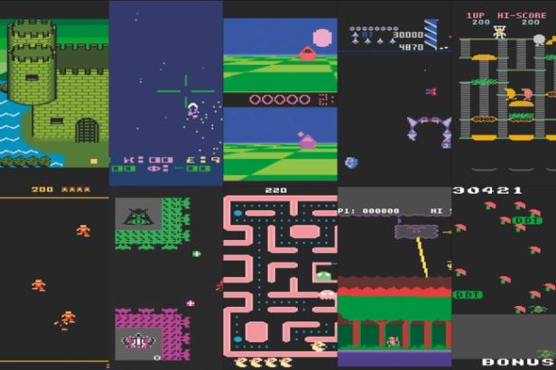

<center>



</center>

Recently I started exploring reinforcement learning. I am currently following the book, [Deep Reinforcement Learning in Action](https://www.manning.com/books/deep-reinforcement-learning-in-action). Now most courses, or book will uses the [openAI Gym](https://gym.openai.com/). The issue you'll run into here would be how to render these gym environments while using Google Colab. In this blog post, I will discuss a few solutions that I came across using which you can easily render gym environments in remote servers and continue using Colab for your work. 

## Method 1: Render the environment using matplotlib

This is the simplest method, using which we just draw, clear and re-draw images using [matplotlib](https://matplotlib.org/). 

So how to do this? Let's take a step by step look at this method: 

**Step 1: Installing Xvfb**

Installing X11 system dependencies. [Xvfb](https://www.x.org/releases/X11R7.6/doc/man/man1/Xvfb.1.xhtml) is an X server that can run on machines with no display hardware and no physical input devices. 

```bash 
!apt-get install -y xvfb x11-utils
```

**Step 2: Installing additional python dependencies**

Next, we need to install a Python wrapper, `pyvirtualdisplay` which interacts with Xvfb virtual displays from within Python. Along with this, we need to install the python binding for openGL. 

```bash 
!pip install pyvirtualdisplay PyOpenGL PyOpenGL-accelerate
```

**Step 3: Creating the virtual display**

Run the following command: 

```bash
!echo $DISPLAY
```

This will show you that currently there is no display. 

In order to start the display, write and execute the following python code: 

```python
import pyvirtualdisplay

display = pyvirtualdisplay.Display(visible=False, size=(1080, 920))
display.start()
```

Now if you run `!echo $DISPLAY`, you'll notice it has been set to a value, meaning that there is now a virtual display up and running. 

These steps will be common to all the methods we discuss below. 

**Step 4: Rendering the gym environment**

In this method, we declare our environment as we usually do, 

```python
env  = gym.make('CartPole-v0')
```

Next, we use matplotlib. 

```python
import matplotlib.pyplot as ply

img = plt.imshow(env.render('rgb_array'))
for _ in range(100):
    curr_state, _, done, info = env.step(action) 

    display.clear_output(wait=True)
    img.set_data(env.render('rgb_array'))
    plt.axis('off')
    display.display(plt.gcf())

    if done:
        env.reset()
```

That's it. But this method has a few cons. The environment will be rendered in such a way that it looks like it's moving a bit too slow, and the display itself seems to be flickering. While we don't want this to happen ideally, in case we have less memory available, this is the way to go. 

If you have some memmory free, continue reading on the next two methods which while memory intensive, display the rendered environment without any lags. 

## Method 2: Using the official `gym.wrappers.Monitor`

In this method, we save the environment image at each step, and then display it as a video. We don't even need to use `env.render()` here since `env.step()` will automatically save display image with proper timing. 

```python
import base64
import io
import gym
from gym.wrappers import Monitor
from IPython import display
from pyvirtualdisplay import Display

d = Display()
d.start()

env = Monitor(gym.make('CartPole-v1'),'./')

o = env.reset()

for _ in range(100):
    curr_state, _, done, info = env.step(env.action_space.sample()) # Take action from DNN in actual training.

    if done:
        env.reset()

for f in env.videos:
    video = io.open(f[0], 'r+b').read()
    encoded = base64.b64encode(video)

    display.display(display.HTML(data="""
        <video alt="test" controls>
        <source src="data:video/mp4;base64,{0}" type="video/mp4" />
        </video>
        """.format(encoded.decode('ascii'))))
```

## Method 3: Using `colabgymrender`

This method basically uses a python package called `moviepy` to displlay videos in colab. Here we "record" the envrionment, save it, and then display the saved video. All of this is done using a package called `colabgymrender`.

```bash 
!apt-get install -y xvfb python-opengl ffmpeg > /dev/null 2>&1
!pip install -U colabgymrender
```

Now let's write the code for displaying the environment using this method. 

```python
import gym
from colabgymrender.recorder import Recorder

env = gym.make('CartPole-v0')
directory = './video'
env = Recorder(env, directory)

curr_state = env.reset()
done = False
while not done:
  action = env.action_space.sample()
  curr_state, _, done, info = env.step(action)

env.play()
```

So these are the 3 methods you can use for rendering gym environments in Google Colab. I prefer to use the third method, but the second and third one really do the same thing, so anyone of them can be used. In case of memory constraints, there is no choice, but to make use of the first method, which albeit slow, is highly memory efficient since we aren't storing the recordings of an entire environment being rendered for a 100 times in a loop or more. 