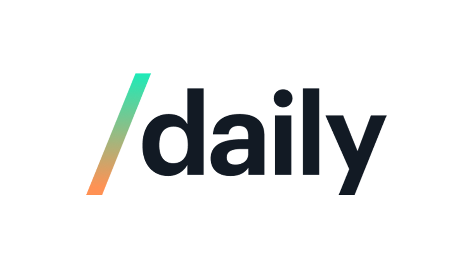

<center>



</center>

Over the last year, there has been an increasing demand for high-quality, live video streaming. Such demands have been made from customers hosting classes, large business
meetings, company meetings, and a lot more. Since all these meetings are interactive, with multiple participants attempting to speak at the same, a "Raise Your Hand" feature
is becoming a necessity. If anyone besides the speaker wants to speak at any point in the meeting, has a question, they can raise their hand to get noticed, after which a 
meeting moderator can give everyone who raised their hands a chance to speak in an organized way. If everyone just starts speaking at the same time, imagine the chaos
in an online meeting!

<p align="center">
  
</p>

In today's tutorial, we will learn how to integrate a **Raise Your Hand** feature in [Daily Prebuilt](https://www.daily.co/prebuilt). A short line about Daily Prebuilt - 
It is Daily's plug and play option for effortlessly embedding video calls into any application. 

## Getting Started

Before we dive in, be sure to have [signed up for a Daily account](https://dashboard.daily.co/signup). After logging in, you can either [create a room](https://dashboard.daily.co/rooms/create)
through the Dashboard or the [REST API](https://docs.daily.co/reference#create-room).

For the tutorial, we'll be using Daily Prebuilt as a base to build upon. You can clone the [Daily Prebuilt demo repository](https://github.com/daily-demos/prebuilt-ui/tree/main)
from GitHub and set it up locally. 

To run the demo locally, clone it and run the following command in your terminal: 

```bash
npm install
npm run dev
```

To view the app, open `http://127.0.0.1:8080/` or `http://localhost:8080` in the browser of your choice. 

## Registering participant events

The key here is to register events such as a participant joining, updating themselves, or leaving the meeting based on which we can keep a list of all participants in 
the meeting. We will be making use of the following events:

1. [participant-joined](https://docs.daily.co/reference/daily-js/events/participant-events#participant-joined): Fires when a new remote participant has joined the call. 
2. [participant-updated](https://docs.daily.co/reference/daily-js/events/participant-events#participant-updated): Called when a local or remote participant's state changes.
3. [participant-left](https://docs.daily.co/reference/daily-js/events/participant-events#participant-left): Triggered when a remote participant leaves the call.

There are 2 main files we need to be aware of for this tutorial: 

1. index.html
2. index.js

We will need to add these events to the `callFrame` using `on()`. This can be done in `index.js` by updating the `createCallframe()` function:

```js
callFrame
    .on('loaded', showEvent)
    .on('started-camera', showEvent)
    .on('camera-error', showEvent)
    .on('joining-meeting', toggleLobby)
    .on("joined-meeting", handleJoinedMeeting)
    .on("left-meeting", handleLeftMeeting)
    .on("participant-joined", handleNewParticipant)
    .on("participant-left", handleParticipantUpdate)
    .on("participant-updated", handleParticipantUpdate)
    .on("app-message", handleReceivedMessage);
```

Here we have added new triggers for participant events and the corresponding functions which will be called if an event is triggered. An additional event added is
`app-message` which fires when any participant in a meeting broadcasts a message to other participants. This is what we will be using to help all participants see
whether other participants have raised their hands or not. 

## Making the UI for raising and viewing raised hands

Now we'll be creating the UI for providing a user with a button to raise their hand, and see the hand status of other meeting participants. Here, we will be working
with the `index.html` file. We will add a new div below the **Call Overview** div. 

```js
<div class="participants-panel">
   <h3>Participants</h3>
   <div class="participants-section">
      <div class="local-participant-info ">
         
         <p class="name-label"><strong>You</strong></p>
         <button
            class="button is-primary hidden raise-hand-button"
            onclick="changeHandState()"
            >
         <p class="hand-state has-text-right"></p>
      </div>
      <ul class="participant-list"></ul>
   </div>
</div>
```

This section creates a div called the `local-participant-info` in which a user can see their own hand status, along with having a button to raise or lower their hand. 
Below this section, lies the `participant-list` which will be populated during the call and updated with the hand state of other participants. 
For brevity, we have removed the divs with the network information and custom controls, but if you want, you can keep those.

Since the image of a raised hand should be displayed only when a hand is raised, it is `hidden`. You can add simply add this to your CSS, in this case, `index.css`
for the functionality. Since we introduced a new div, `participants-panel`, we can add some styling for that in the CSS as well:

```css
.hidden {
  display: none !important;
}

.participants-panel {
  margin: 24px;
  padding-bottom: 24px;
}
```

Let's take a sneak peek at this would look to a user.

| Hand Raised | Hand Lowered |
|----|----|
|  | |


Looks cool, right?

## Some background information about the methods in `index.js`

If you're familiar with Daily Prebuilt and how a meeting is created and joined, you can probably skip this section and move on to the next one where we start implementing the
raise hand feature. 

All the functions we need, daily-js, the entire meeting iframe has been imported in the html, `<script src="https://unpkg.com/@daily-co/daily-js"></script>`. This 
does most of the heavy lifting for us. 

When a user tries to join a meeting, the function `createRoomAndStart()` and start is called. The functions checks if the meeting link is valid, and if it is, 
the `.join()` function is used to join the meeting. 

If you want to change your meeting URL, you can update the URL being returned in the `createRoom()` method. You can also generate a new unique URL for every meeting
(recommended for production) by following the instructions about commenting and uncommenting code. 

## Let's dive into js

### Initializing the attendee

Here we will initialize the local attendee along with a property, `handRaised`. In the next step, we will further update the attendee in the `handleJoinedMeeting()` 
method with the properties obtained from daily-js. 

```js
let attendee = {
  handRaised: false
};
```

Before we go into the logic for implementing the raise hand feature, we need to make small changes to the `handleJoinedMeeting()` and `handleLeftMeeting()`
functions in `index.js`. These edits are mainly to update the local attendee properties, the UI and set the initial hand raised state for a participant, and update the UI once the attendee leaves 
the meeting.

```js
async function handleJoinedMeeting(e) {
  attendee = {
    ...e.participants.local,
    handRaised: false
  };

  let attendeeInformationDisplay = document.querySelector(
    ".local-participant-info"
  );
  attendeeInformationDisplay.innerHTML = `
      
    <p class="name-label"><strong>${attendee.user_name + " (You)" ||
    "You"}</strong></p>
    <button
      class="button is-info raise-hand-button"
      onclick="changeHandState()"
      >Raise Hand
    </button>
    <p class="hand-state has-text-right">Your hand is down 💁</p>
`;
  await handleParticipantUpdate();
  setTimeout(isHandRaised.sendAttendeeHandState, 2500)
  toggleLobby();
  toggleMainInterface();
}

function handleLeftMeeting(e) {
  document.querySelector(".participants-section").classList.toggle("hidden");
  let list = document.querySelector(".participant-list");
  list.innerHTML = "";
  toggleMainInterface();
}
```

### Handling participants events

1. Handling `participant-joined`:

```js
async function handleNewParticipant() {
  attendee = { ...attendee };
  await handleParticipantUpdate();
  setTimeout(isHandRaised.sendAttendeeHandState, 2500)
}
```

2. Handling `participant-updated` and `participant left` is done by the `handleParticipantUpdate()` dicussed in detail later on. 

3. Handling `app-message`:

This event is triggered when a message is received from another participant, that is if another participant raises or lowers their hand. The function simply updates
the list of participants with raised hands, which in turn updates the UI accordingly. 

```js
async function handleReceivedMessage(e) {
  isHandRaised.updateList(e);
}
```

### Raising and lowering the hand

Now we will create a function that will check the current hand state of the attendee and raise or lower the hand accordingly. This function is executed when the
raise hand button is pressed. It updates the UI of the button, as well as a text element to show whether the hand is raised or not, and calls the `handleParticipantUpdate()`
function which updates the UI(we will go more into the details of this in further sections)

```js
/* This is the function called if an attendee presses on 
the raise hand button and handles the change in state */
async function changeHandState() {
  isHandRaised.toggleState();
  isHandRaised.sendAttendeeHandState();
  handleParticipantUpdate();
  document.getElementById("hand-img").classList.toggle("hidden");
  document.querySelector(".raise-hand-button").innerText = `${
    attendee.handRaised ? "Lower Hand" : "Raise Hand"
    }`;
  document.querySelector(".hand-state").innerText = `${
    attendee.handRaised ? "Your hand is raised 🙋" : "Your hand is down 💁"
    }`;

  // Turn on video if hand is raised
  if (attendee.handRaised && !callFrame.participants().local.video) {
    callFrame.setLocalVideo(!callFrame.participants().local.video);
  } 
}
```

In order to catch the attention of a moderator in case the moderator has turned off the video for participants, when someone raises their hand, we also turn on their camera. If you don't want the camera to be turned on, you can just comment out the last if condition(last 3 lines in the function). 

### Broadcasting the hand state to other attendees

In order for the other participants to view the hand state of the attendee, we create an object with handStates of all participants, along with methods to update the
hand state of the local attendee. This object can be declared as follows:

```js
let isHandRaised = {
  list: [],
  sendAttendeeHandState() {
    let data = {
      handRaised: attendee.handRaised,
      session_id: attendee.session_id
    };
    callFrame.sendAppMessage(data, '*');
  },
  updateHandStates(e) {
    this.list = [...this.list].concat([
      { session_id: e.fromId, handRaised: e.data.handRaised }
    ]);
    handleParticipantUpdate();
  },
  deleteHandState(e) {
    this.list.splice(this.list.indexOf(e.data.session_id), 1);
    handleParticipantUpdate();
  },
  updateList(e) {
    e.data.handRaised
      ? isHandRaised.updateHandStates(e)
      : isHandRaised.deleteHandState(e);
  },
  toggleState() {
    attendee = {
      ...attendee,
      handRaised: !attendee.handRaised
    };
  }
};
```

The broadcast here is done with the help of the [`sendAppMessage()`](https://docs.daily.co/reference/daily-js/instance-methods/send-app-message) function provided
by daily-js. This object handles updates to hand states, deleting the hand state of a participant who leaves the meeting and toggling the hand state of the local attendee. 
The main idea of the list here is to store the session id of the participants with raised hands which we will use in `handleParticipantUpdate()`. 

### Updating the UI depending on hand states

This is the final step - toggling the UI to show which participants have their hands raised and lowered. 

```js
/* The function handling all UI changes when attendess raise or lower 
their hands*/
function handleParticipantUpdate() {
  let listRaisedHands = isHandRaised.list.map(caller => caller.session_id);
  let listParticipants = callFrame.participants();
  let listDisplayParticipants = document.querySelector(".participant-list");
  listDisplayParticipants.innerHTML = "";

  Object.keys(listParticipants).forEach(participantIndex => {
    let participant = listParticipants[participantIndex];
    let callerHandUp = listRaisedHands.includes(participant.session_id);
    let li = document.createElement("li");

    // Leave out the local attendee
    if (participant.local) {
      return;
    }

    let handStateLabel = callerHandUp ? "Hand Raised" : "";
    li.innerHTML =
      `<div>
        ${listRaisedHands.includes(participant.session_id)
        ? ``
        : ""
      }
      ${listRaisedHands.includes(participant.session_id)
        ? `<p>${participant.user_name + " has raised their hand." || "Guest"}</p>`
        : `<p>${participant.user_name || "Guest"}</p>`
      }
        <p class="hand-state has-text-right">${handStateLabel}</p> 
      </div>`;
    listDisplayParticipants.append(li);
  });
}
```

Here, we simply update the UI, display a hand and corresponding text if an attendee has their hand raised, or change these UI elements if an attendee lowers their hands. 
This is done by obtaining the list of participants from the callFrame, `let listParticipants = callFrame.participants();`. Then we check if the session id of a participant
is in the `isHandRaised` object list we created earlier, and update the UI accordingly. We leave out the local participants since they already have a separate UI section
with their details.

On a final note, we use a timeout when setting the hand state of the attendee, so that the message is not broadcasted before a new caller and joined and is actually 
able to receive the message. 

`setTimeout(isHandRaised.sendAttendeeHandState, 2500)`

## Let's take a look at what we did

Now that all the code is implemented, this is how it will look in action: 

1. With 2 attendees:


<p align="center">
  
</p>

2. With 4 attendees:


<p align="center">
  
</p>

As we can see, whenever a participant joins or raises and lowers their hand, the information is updated immediately in the meeting tabs of the other participants.

You can find the full source of the demo [here](https://github.com/yashk2000/raise-hand), and check it out live on it's [Vercel Deployment](http://raise-hand.vercel.app/).

## What's next?

In this tutorial, we learned how to integrate a raise hand functionality directly into the Daily Prebuilt UI. We hope you enjoyed the tutorial, and if you have any questions, 
don't hesitate to reach out to us. 

For the next steps, to customize the UI of Daily Prebuilt further, try updating your [Daily Prebuilt color theme](https://www.daily.co/blog/introducing-color-theming-for-embeddable-video-calls-a-new-feature-for-daily-prebuilt/).
If you want full control over the UI of the meeting frame itself, you can look into the [React Tutorial](https://www.daily.co/blog/building-a-custom-video-chat-app-with-react/) to get started.
