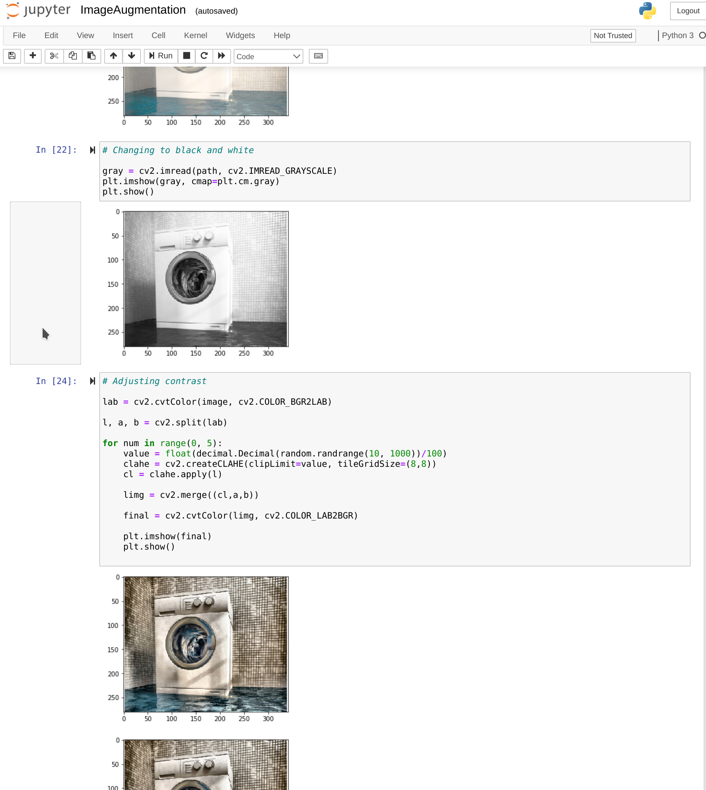
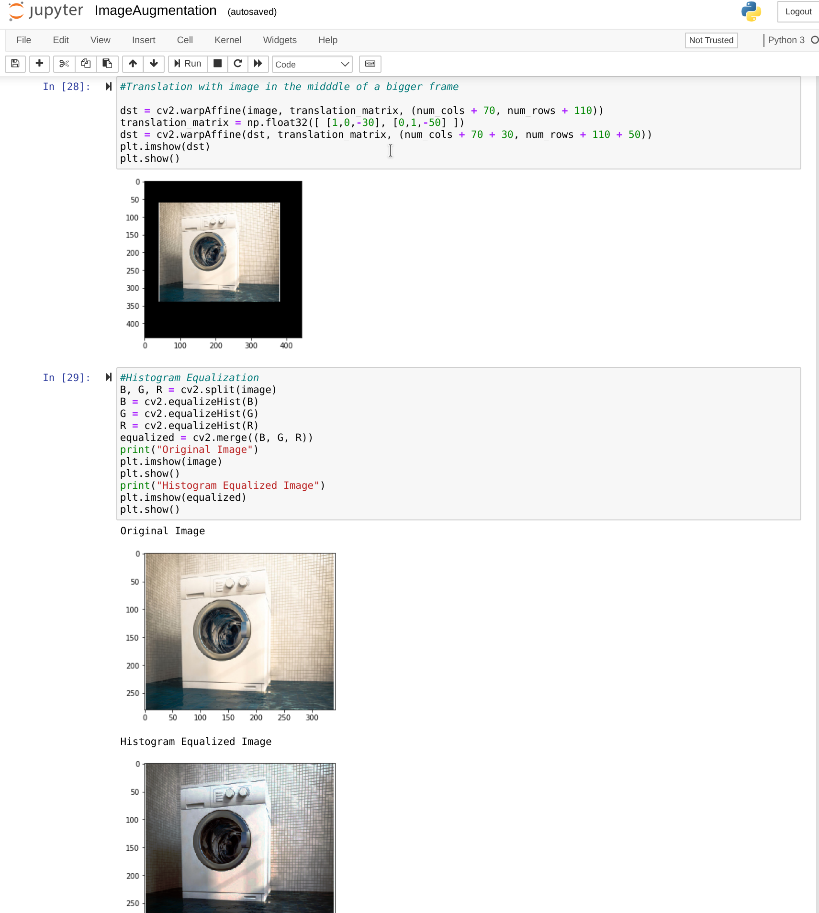
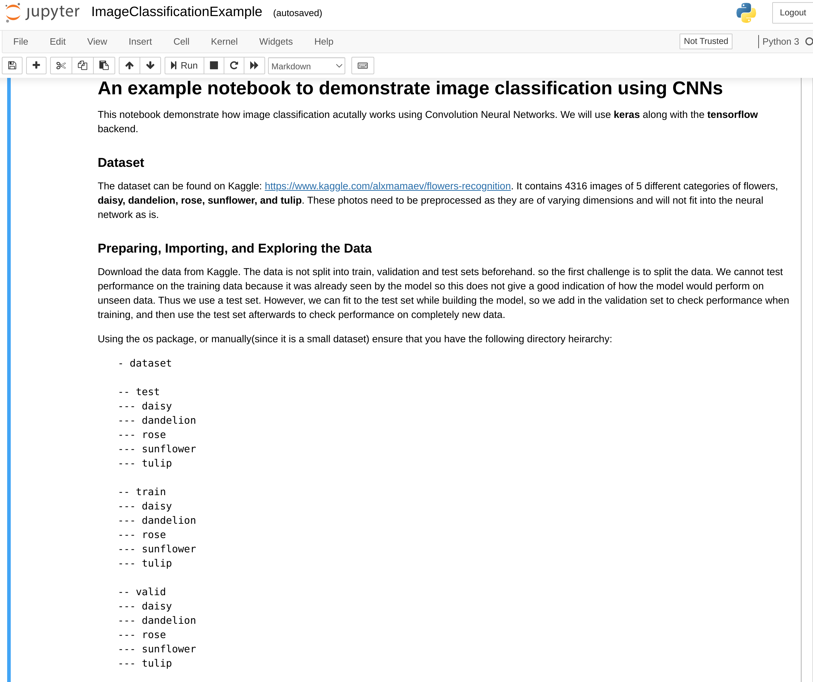
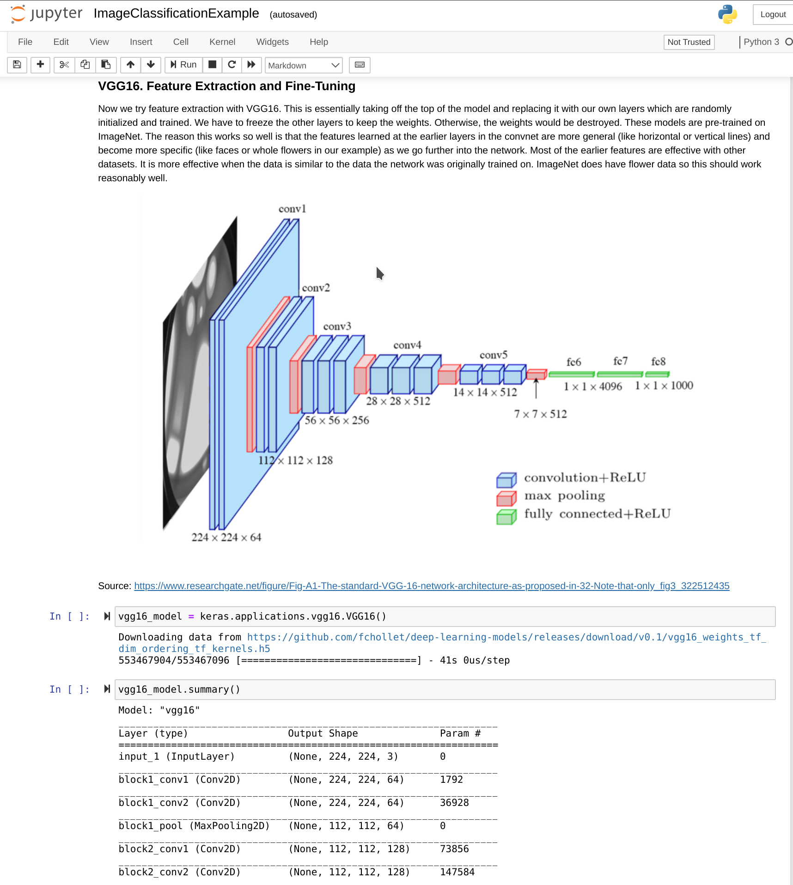
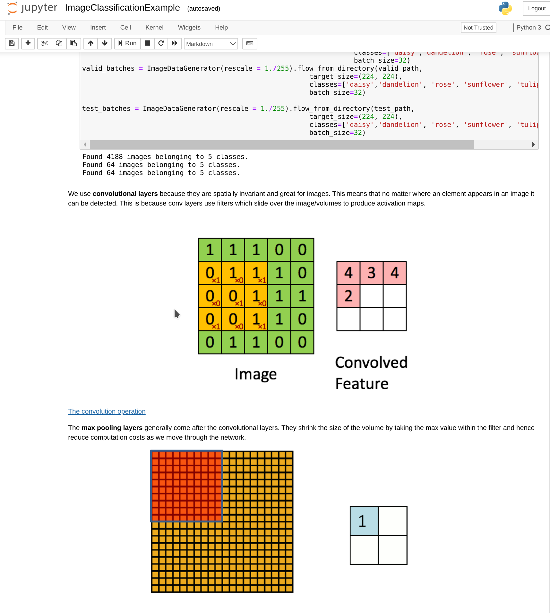
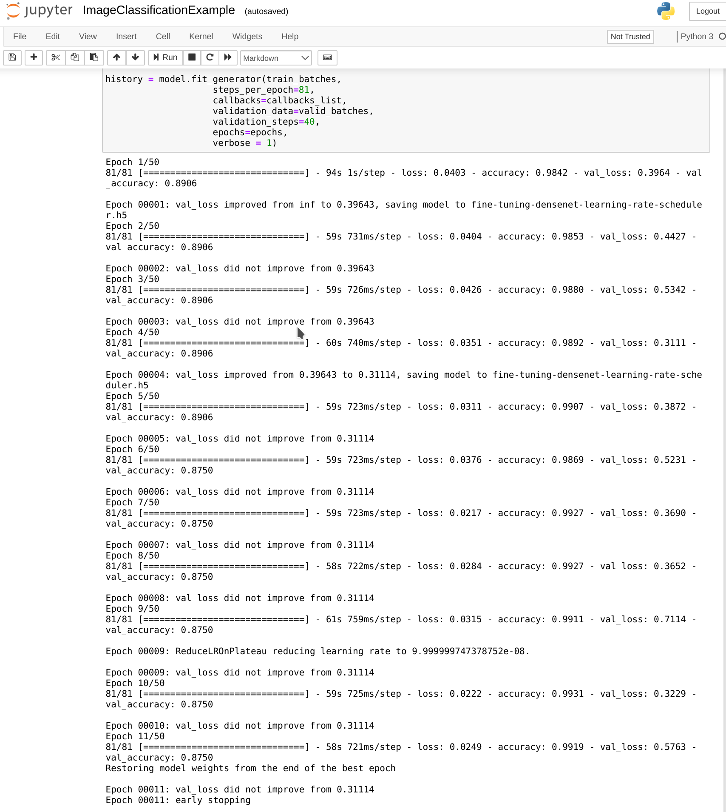
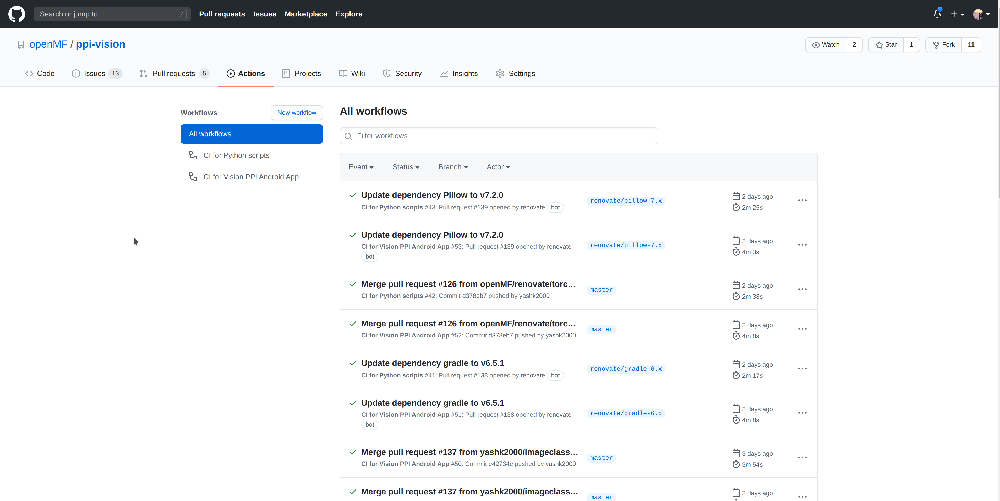

This blog post marks the end of the first coding period of GSoC'20 🤸

The second coding period will begin officially from tomorrow, i.e. the 3rd of July. 

My work during this phase mainly involved improving the part of project which is related to the data collection part of the project. 

The models that will be used have to identify household objects in photos clicked inside a house, a lot of data is not available for such scenarios. I scrape data from
google and use several data augmentation techniques to increase the size of the dataset 📸

The main work done in the augmentation part was:

- Adding augmentation techniques for producing variations in color, for which I added techniques to alter the saturation and hue of an image. The work done for this can 
be found in PR [#95](https://github.com/openMF/ppi-vision/pull/95)✅ 

- Next I added parallel and spotlight augmentation techniques which alter the brightness and contrast of images locally. The work for this is 
in PR [#97](https://github.com/openMF/ppi-vision/pull/97)✅ 

- I also added techniques for blurring images which was done in PR [#90](https://github.com/openMF/ppi-vision/pull/90)✅ 

Next, after writing the code for all these techniques, I made a python script that randomly applies different variations of all these techniques upto 5 times to get the 
maximum amount of augmented images. This work was done in PR [#113](https://github.com/openMF/ppi-vision/pull/113). In order to visualize what each technique does, the
jupyter notebook was also updated accordingly by PR [#115](https://github.com/openMF/ppi-vision/pull/115)✅ 

|   |   |
|------------------|------------------|

Since the project invovled image classification procdeures further on, I also made a simple image classification notebook on a dataset of 5 catogories of flowers that
I found [here](https://www.kaggle.com/alxmamaev/flowers-recognition) on Kaggle. I made this notebook mainly so future contributors can easily understand how the image classification works which we will be handling via Google 
AutoML or do it directly on device using MLKit. The work for this can be found in PR [#137](https://github.com/openMF/ppi-vision/pull/137)✅

|   |   |
|---|---|
|   |   |

The project also didn't have any continous integration. So I worked on introducing continuous integration using GitHub actions for the android part via 
[this change](https://github.com/openMF/ppi-vision/commit/89ad68e1323ee9524423072af5f5a7b29e9c5b77) and for checking the syntax of the python script in PR
[#117](https://github.com/openMF/ppi-vision/pull/117)✅ 

I also did a bit of unplanned work on the android application📱. The login method which was being used was not able to login if I used any of the Mifos APIs other than 
the demo API. So I refactored the login of the application to make it compatible will all the Mifos APIs and used RXJava and Retrofit for building the new login. 
The work for this can be found in the following two PRs: [#131](https://github.com/openMF/ppi-vision/pull/131) and [#133](https://github.com/openMF/ppi-vision/pull/133)✅.

From tomorrow, we'll enter the second coding phase of GSoC'20 which I'm looking forward to. I'll finally start training the models and use the application to predict 
objects in images and use those predictions to automatically fill PPI Surveys!🎆

I'll go into more detail about this part of work in my next blog post 🔥