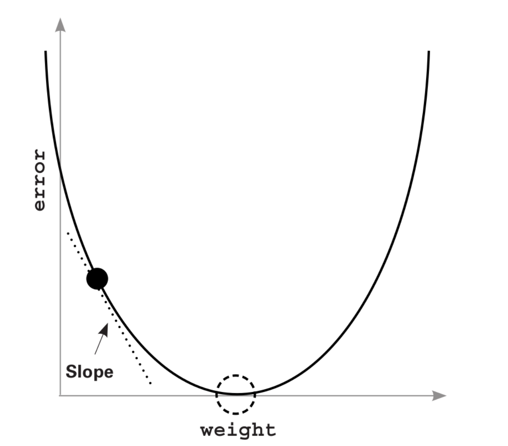

From the previous blogs, we know basically how a machine will make predictions. So obviously, the next question is how will a machine improve the prediction it
makes, how will the prediction be more accurate? This is where we will understand how a machine learns, or in a more technical way, how the algorithm will update
the weights to give a better output. 

In a previous blog, I mentioned the three basic steps of how machine learning works are predicting, comparing and learning. Let’s dive into the comparing and 
learning parts now. 

## 📊 Comparing

After predicting an output, we need to measure how close the output was to the correct answer. Only once we know by how much did our measurement miss, will we 
be able to “learn” where we went wrong. 

For this, we find out the error between the prediction and the true output. The simplest way to find this error is to subtract the input from the output and see
by what margin we were off. 

## 📈 Learning

After comparison, the final step is learning which updates the  weights in a network to make better predictions. In this  blog, we will consider a learning 
algorithm called Gradient Descent.

## 🎯 Finding the error

```python
weight = 0.5
input = 0.3
goal = 1

pred = input * weight

error = (goal - pred) ** 2
print(error)
```

Output: 
```
0.7224999999999999
```

Here we calculated the difference between the prediction made and the goal, and then squared it. This is called the mean squared error. This is one of the 
techniques using which we can find the error. There’ll be a couple of questions coming up about now.

**Why did we square the error?**

We want the error to be positive, and hence we square it. Simply finding the difference between `goal` and `pred` might sometimes give a negative result.

**Why do we need the error to be positive?**

Let’s say you’re practising target shooting. Whether your bullet hits the target 2 centimetres above, or 2 centimetres below, both the times, you missed by 2 
centimetres. In both the cases your error is 2 centimetres. Now instead of squaring if you just find the error, the error will be 2 centimetres, and -2 
centimeters, thereby making the resultant average of the error 0(`2 + (-2) = 0`). This will give us a wrong result. Therefore to include the entire range, we 
keep the error positive by squaring it. 

One thing to note here is: Squaring will make big errors bigger, and small errors, -1 < error < 1, smaller. But this works fine because we will be able to 
penalise bigger errors better, instead of worrying about the small ones. 

## 📉 Gradient descent

So now let’s get into gradient descent. Imagine you are in a valley. You need to get to the bottom of the valley by taking small steps at a time. If your steps 
are too large, you’ll end up crossing the bottom, and if your steps are too small it’ll take you forever to get to the bottom. The algorithm which will help you
get to the bottom efficiently is gradient descent. 



We are currently at the black dot, and we want to get to the dotted circle, which is the bottom.   

The basic rule of machine learning: We need to keep adjusting the weights so that the error reduces to 0.

Let’s see the code for a basic implementation of gradient descent: 

```python
weight, goal_pred, input = (0.0, 0.5, 1.1)

for iteration in range(4):
	print("-----\nWeight:" + str(weight))
	pred = input * weight
	error = (pred - goal_pred) ** 2
	delta = pred - goal_pred
	weight_delta = delta * input
	weight = weight - weight_delta
	print("Error:" + str(error) + " Prediction:" + str(pred))
	print("Delta:" + str(delta) + " Weight Delta:" + str(weight_delta))
```
Output: 
```
-----
Weight:0.0
Error:0.25 Prediction:0.0
Delta:-0.5 Weight Delta:-0.55
-----
Weight:0.55
Error:0.01102500000000002 Prediction:0.6050000000000001
Delta:0.1050000000000001 Weight Delta:0.11550000000000012
-----
Weight:0.43449999999999994
Error:0.00048620250000000064 Prediction:0.47795
Delta:-0.022050000000000014 Weight Delta:-0.024255000000000016
-----
Weight:0.45875499999999997
Error:2.1441530249999833e-05 Prediction:0.5046305
Delta:0.004630499999999982 Weight Delta:0.0050935499999999806
```

**What does each variable do here?**

| pred  | The prediction made by the network   |
|---|---|
| error  | The mean squared error   |
| delta  | The absolute error with it’s sign   |
| weight_delta  | Calculating the amount by which the weights need to be changed along with the direction (positive or negative, increase or decrease)   |

Here we calculated the `weight_delta` by multiplying the delta with the input. The reason for this is so that the change to be made in the weights can be scaled.
Basically, if the input is big, the amount by which we change the weight should also be big.

This is the simplest implementation of gradient descent in which we: 
- Find the prediction
- Find the mean squared error
- Find the absolute error
- Find the amount by which the weight needs to be updates
- Update the weight

As we keep improving the algorithm, the underlying steps will still follow the same principles. 

Let’s dig deeper into `weight_delta` before we proceed further. `weight_delta` is a derivative. A derivative simply allows us to pick a couple of variables in a
formula and figure out how they relate to each other. Here, `weight_delta` is what is determining the relation between the `error` and the `weight`. Our 
derivative, `weight_delta` tells how much did changing a weight contribute to the error. 

|   |
|---|
| How gradient descent reaches the bottom  |

Now, in the algorithm we ran, try to set the `goal_pred` variable to 4.

Output: 
```
-----
Weight:0.0
Error:0.25 Prediction:0.0
Delta:-0.5 Weight Delta:-2.0
-----
Weight:2.0
Error:56.25 Prediction:8.0
Delta:7.5 Weight Delta:30.0
-----
Weight:-28.0
Error:12656.25 Prediction:-112.0
Delta:-112.5 Weight Delta:-450.0
-----
Weight:422.0
Error:2847656.25 Prediction:1688.0
Delta:1687.5 Weight Delta:6750.0
```

The output is not even remotely close to 2, and the error just kept on increasing. The reason for this is they way we are updating the weights. 

`weight = weight - (input * (pred - goal_pred))`

The larger, the input, the larger the update to the weight. The network will start overcorrecting in both directions in order to compensate for the error. 

Imagine you’re blindfolded and are jumping down a mountain in small jumps to get to the bottom. So you keep taking small jumps. In case of this current 
scenario, let’s assume you miss the bottom, and jump up to the other side which starts going up. You know now that you’ve crossed the bottom since you’re going
further away from your goal. So now in order to take a step back, you jump in the reverse direction. But since your input is already big, it’ll result in your 
jump taking you back up to the other side of the mountain. This will keep continuing, the error increasing, and you going further away from the bottom.

This is known as divergence. 

## 🤼‍♂️ How to combat divergence?

Now that we know where our algorithm lacks, we need to improve it. The error is basically that the network is overshooting. What if we could simply multiply the
weight update by a small number which compensates for this overshooting? This way, we would be taking smaller steps instead of jumping here and there.

For this purpose, we use a variable called alpha. The alpha value generally ranges between 0 and 1. `alpha` is something which we need to find out, mostly by
guesswork(there are more elegant solutions to this than guesswork which we can get to later). We can try out different values of alpha ranging between 0 and 1,
like 0.1, 0.01, 0.001, etc, and keep on adjusting it until we feel the value is optimal and there won’t be any major overshooting. 

So we will simply multiply our derivative with alpha. Let’s take a look at the updated code which includes `alpha` as well.

```python
weight, goal_pred, input = (0.0, 0.5, 4)
alpha = 0.1

for iteration in range(4):
	print("-----\nWeight:" + str(weight))
	pred = input * weight
	error = (pred - goal_pred) ** 2
	delta = pred - goal_pred
	weight_delta = delta * input
	weight = weight - (alpha * weight_delta)
	print("Error:" + str(error) + " Prediction:" + str(pred))
	print("Delta:" + str(delta) + " Weight Delta:" + str(weight_delta))

```

Output: 
```
-----
Weight:0.0
Error:0.25 Prediction:0.0
Delta:-0.5 Weight Delta:-2.0
-----
Weight:0.2
Error:0.09000000000000002 Prediction:0.8
Delta:0.30000000000000004 Weight Delta:1.2000000000000002
-----
Weight:0.07999999999999999
Error:0.03240000000000002 Prediction:0.31999999999999995
Delta:-0.18000000000000005 Weight Delta:-0.7200000000000002
-----
Weight:0.15200000000000002
Error:0.011664000000000022 Prediction:0.6080000000000001
Delta:0.1080000000000001 Weight Delta:0.4320000000000004
```

The output is now a lot closer to 0.5, than what it was before. This means we’re on the correct track. Now we can just increase the number of iterations from 4
to 20 in order to get the desired result. 

```python
weight, goal_pred, input = (0.0, 0.5, 4)
alpha = 0.1

for iteration in range(20):
	print("-----\nWeight:" + str(weight))
	pred = input * weight
	error = (pred - goal_pred) ** 2
	delta = pred - goal_pred
	weight_delta = delta * input
	weight = weight - (alpha * weight_delta)
	print("Error:" + str(error) + " Prediction:" + str(pred))
	print("Delta:" + str(delta) + " Weight Delta:" + str(weight_delta))

```

Output: 
```
-----
Weight:0.0
Error:0.25 Prediction:0.0
Delta:-0.5 Weight Delta:-2.0
-----
Weight:0.2
Error:0.09000000000000002 Prediction:0.8
Delta:0.30000000000000004 Weight Delta:1.2000000000000002
-----
Weight:0.07999999999999999
Error:0.03240000000000002 Prediction:0.31999999999999995
Delta:-0.18000000000000005 Weight Delta:-0.7200000000000002
-----

.
.
.
.
Weight:0.1249647361261568
Error:1.9896652774865827e-08 Prediction:0.4998589445046272
Delta:-0.00014105549537279938 Weight Delta:-0.0005642219814911975
-----
Weight:0.1250211583243059
Error:7.16279499894418e-09 Prediction:0.5000846332972236
Delta:8.463329722363522e-05 Weight Delta:0.00033853318889454087
-----
Weight:0.12498730500541645
Error:2.5786061996210327e-09 Prediction:0.4999492200216658
Delta:-5.077997833419223e-05 Weight Delta:-0.00020311991333676893
-----
Weight:0.12500761699675011
Error:9.282982318601891e-10 Prediction:0.5000304679870005
Delta:3.046798700045983e-05 Weight Delta:0.00012187194800183931
```

We got to the output, 0.5000304679870005 which is almost equal to 0.5 and the error is almost negligible now. 

So this is basically how gradient descent works under the hood and how machines can learn. In the next blog, we will play with gradient descent a bit more, 
learn to use it with multiple inputs, outputs, and tweak some aspects of the weights to get better results. 
