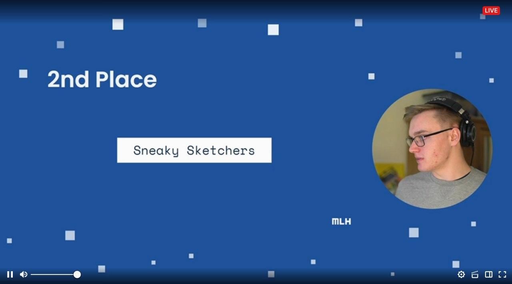

The MLH Fellowship finally came to an end on 21st December 2020. It was an amazing 3 months I spent as a part of the first ever Explorer Batch of the Fellowship 1️⃣. 
I was selected for the batches starting from 21st September, being among one of the around 170 Fellows selected for the Fall Season of the Fellowship 👣

The main aim of the Explorer batch is to work in 2 week hackathon like sprints and most of the time we end up working with something we haven't worked with before. 
Since my batch started on the 21st of September, we had a total of 6 sprints. Each sprint had a unique theme and indsutry focus such as clean code, unit testing, 
continous integration, documentation, etc 👨‍💻

Let's just take a brief look at all the sprints. 

**🏃‍♂️ Sprint 1**

This was the first open ended sprint in which I worked on a mobile application help the visually impaired perceive the world around them better. In this sprint, 
I worked extensively with flutter, to create a cross platform mobile app. I have worked with flutter before, but this was the first time I worked with it so 
extensively, integrating tflite models, performing operations on a live video stream, etc. Also, my team won the first place in this sprint 🎉. 

More details: [https://yashkhare.me/blog/mlh-fellowship-fall-2020-sprint-1](https://yashkhare.me/blog/mlh-fellowship-fall-2020-sprint-1)

**🏃‍♂️ Sprint 2**

The second sprint was amazing for me becuase I got to work with 2 things, I have always wanted to get my hands dirty with, but I never did. The theme of the sprint
was Education and we built a platform to help learners find currated lists of resources made by industry experts along with getting paired up with mentors. We used
Django for the backend and React for the frontend. I got to finally get how to work with these tech stacks, and in the end, our project ended up coming third in the finale 🎉. 

More details: [https://yashkhare.me/blog/mlh-fellowship-fall-2020-sprint-2](https://yashkhare.me/blog/mlh-fellowship-fall-2020-sprint-2)

**🏃‍♂️Sprint 3**

This time, I ended up working with something, I never thought I would ever work with. The theme of this sprint was Gaming, and my team developed a Halloween Themed game
using the Godot Game Engine. I also learned how to write a CI script for Godot Apps, and deploy them to the web as well. In this sprint, our project came on the third 
place in thhe finale  🎉. 

More details: [https://yashkhare.me/blog/mlh-fellowship-fall-2020-sprint-3](https://yashkhare.me/blog/mlh-fellowship-fall-2020-sprint-3)

**🏃‍♂️ Sprint 4**

The theme of this sprint was AI/ML/Data Science. I worked on developing a dekstop app for image inpainting based on the research paper on Partial Convolutions by NVIDIA. 
I worked on making the desktop app with PyQt, my first experince with it, and also developing the ML part using PyTorch. I worked with PyTorch to this extent for the
first time. Our project came second in the global finale for this sprint 🎉. 

More details: [https://yashkhare.me/blog/mlh-fellowship-fall-2020-sprint-4](https://yashkhare.me/blog/mlh-fellowship-fall-2020-sprint-4)

**🏃‍♂️ Sprint 5**

In this sprint, I did another thing, I've never done before, work on creating a CLI application. I used Javascript for making the application. The theme of the sprint 
was Developer Tools and Productivity. We built a tool called gitg0 which auto-suggests commit messages, branch names and automatically ensures that the commit 
guidelines for a particular repo are followed 💻. 

More details: [https://yashkhare.me/blog/mlh-fellowship-fall-2020-sprint-5](https://yashkhare.me/blog/mlh-fellowship-fall-2020-sprint-5)

**🏃‍♂️ Sprint 6**

This was the final sprint with the theme of social good. This time we built a remote health monitoring application with both, web and mobile clients. We made the web app
using React, and the mobile app in flutter, along with the backend in Flask 👨‍⚕️. 

More details: [https://yashkhare.me/blog/mlh-fellowship-fall-2020-sprint-6](https://yashkhare.me/blog/mlh-fellowship-fall-2020-sprint-6)

|  |  |
|---|---|
| Sprint 1 | Sprint 2 |
|  |  |
| Sprint 3 | Sprint 4 |

**🚩 The Graduation CTF**

After the 6th sprint ended, we had a CTF, a Capture The Flag contest. The contest was really fun with my team, Ankit, Rohan, and Shivay. We spent around 5 sleepless 
days and our team, MLH-flag{bearers} ended up coming second 2️⃣. Sad story, we missed the first position by just around 3 minutes 🙁. But we did manage to solve all the challenges, and I learned a 
lot. Ankit proved himself to be the God of brute force. This was a really fun ending to the Fellowship, all thanks to Karan and Gabriel for making such an 
amazing CTF. 

|   |
|---|
| 2nd, MLH-flag{bearers}  |
|   |
| Top 10 team stats  |

**🎓 Graduation**

Finally, after the CTF, the graduation day came, on the 21st of December. We had our last live stream on Twitch by Will Russell. 
Our sprint 1 project, Helping Hands was also featured during the Graduation Ceremony 🔥. 

|   |
|---|
| Helping Hands  |
|   |
| Graduation  |

Overall, I had a lot of fun during the Fellowship, made new friends, and learned new things that I otherwise might not have even touched. 

|   | 
|---|
| **The Fellow Batch of the MLH Fellowship(Fall 2020)**  |

(I'm in the last row 👀)