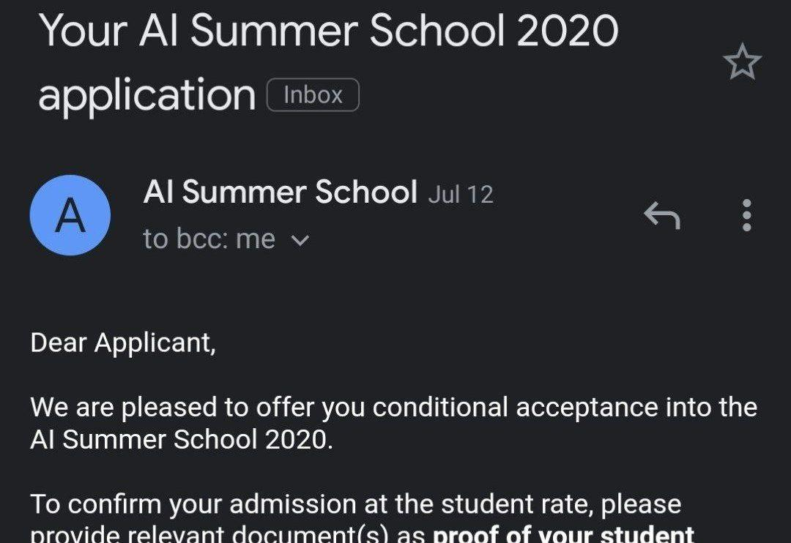
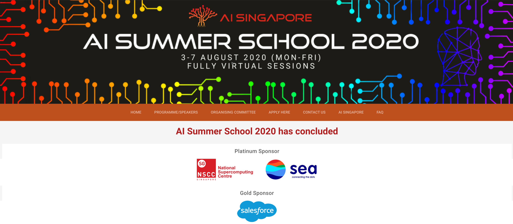
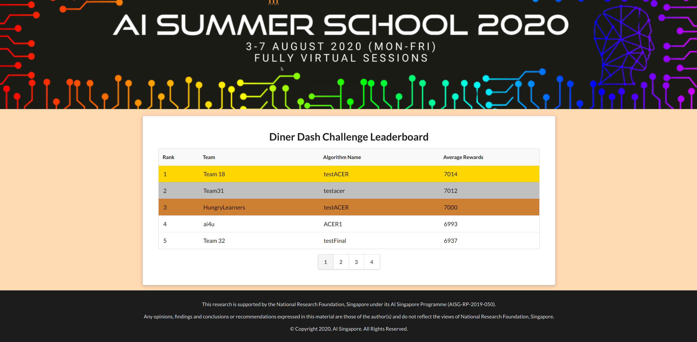
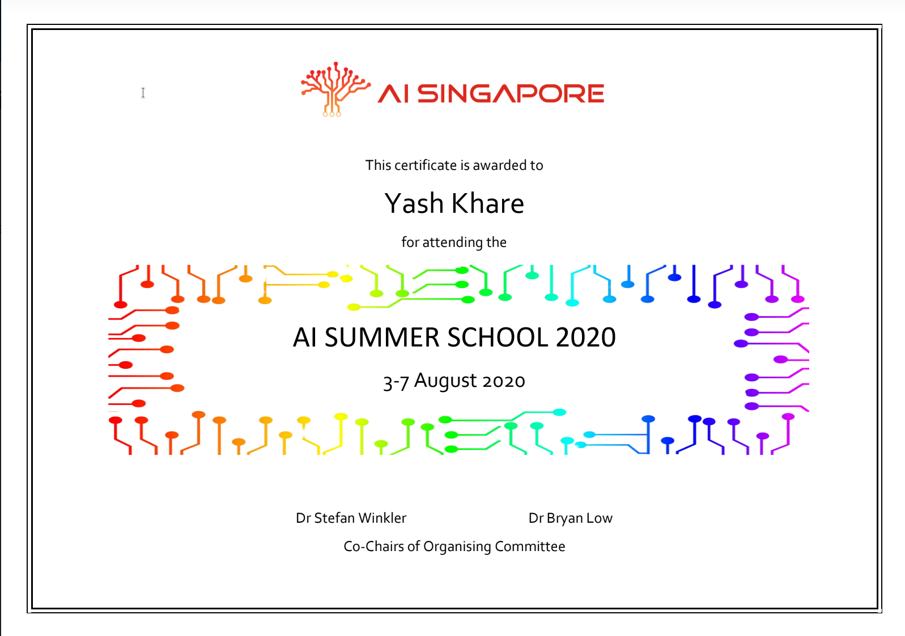

Every year, [AI Singapore](https://www.aisingapore.org/) organizes an AI Summer School. Due to the pandemic this year, the summer school was to be hosted online from 3 
August to 7 August 2020. I completed and submitted my application for the program in the first week of July. The results were announced on 12 July 2020 and I was very excited to have been selected
for the summer school 🤸

The summer school then started on 3rd August 2020. It was help over Zoom. Being in India, the summer school started at 6:30AM IST till around 4-5PM in the evening. I attended
the sessions with [Abhijit Ramesh](https://github.com/abhijitramesh) and [Vishwaak Chandaran](https://github.com/Vishwaak), 2 members from [amFOSS](https://amfoss.in/) who were 
also selected for the summer school. Since all of us working the field of machine leanring, it was a great experince for us to attend the summer school while 
having discussions amongst ourselves 🙇🏻

**Day 1: 3rd August 2020 **

Day 1 started out with an opening speech by the program organizers, Stefan Winkler and Bryan Low, from AI Singapore. Then started the first session, *Gaussian Processes: Theory & Applications*, 
by Dr Trọng-Nghĩa. During the session, we were given an overview of Gaussian processes (GPs) which provide a principled non-parametric approach to model prior probability distribution
over random functions. Dr Trọng also discussed how Gaussian process and its approximations can be further extended to some of the existing trends in machine learning such
as active learning, deep learning and federated learning 🎆

The next session was on *Low-resource Machine Learning*, taken by Asst. Prof Joey Tianyi. During the talk, we leanred how to tackle the low-resource challenges such
as low-resource data or constrained computing resources to solve many important problems in real-world applications. We learned about how data is migrating, first
from on-premises to cloud data centres and now, from cloud to the "edge”, where it is being generated. Edge AI devices operate with tight resource budgets such
as memory, power, and computing horsepower where as AI technology with high-end GPUs for training and running large neural networks are not suitable for edge AI. Prof Joey 
discussed about how the limitations are being overcome and what it's impact could be in the future 🎯

In the nest session on *Monitoring model performance in production systems* by Han Quio, we learned about how to use [Prometheus](https://github.com/prometheus/prometheus) for practical techniques in detecting
feature and inference drifts, and how they can be applied at scale. A live demo was also shown to guide us through instrumenting, training and model serving code, and
crafting PromQL for real time analysis 🪅

Up next, we had the first keynote session of the Summer School *AI @ Scale – Trends and Lessons Learnt from Large-scale Machine Learning Projects* by Dr Wee Hyong Tok.
We learned the key trends in machine learning and deep learning, grounded on practical lessons from working on AI projects with some of the world's largest
Fortune 500 companies, on evolving their AI ideas from proof of concept to production systems. We were given real life examples from Google Research projects which were
really great.  We also saw how AI is used to solve some of the world's toughest challenges in sustainability ✨

The last session of day 1 was on *Ethics and Governance of AI* by Prof Leong Tze Yun. This talk gave a very detailed overview of how to build Responsible AI. 
We also examined how these principles would guide us in an engineering approach to harness the power of AI to benefit society and economy, especially during and after the
COVID-19 pandemic 🔥

**Day 2: 4th August 2020**

This was perhaps the best day of the summer school 😁. We were given a choice to join a hands-on workshop on Computer Vision or Reinforcement Leanring. Me, along with my
friends from amFOSS, opted for the Reinforcement Leanring working. We started out with a workshop by Dr Akshay Narayan which introduced us the the basics of RL. Then 
we proceeded to play the [DinerDash](https://github.com/AdaCompNUS/diner-dash-simulator) game using Reinforcement Leanring. We made use of the [StableBaslines](https://stable-baselines.readthedocs.io/)
package, a friendlier fork of the Stable Baselines by OpenAI. StableBaslines provides a lot of alogrithms such as ACER, TRPO, ACKTR, etc. We tried using a lot of the
algorithms and in the end got the best result with ACER. Random teams were formed which was great for interaction. I was teamed up with people from Singapore and Malaysia
and we all leanred a lot while solving this. In the end, we just made the challenge with 2 minutes to spare with a reward of 6937 and ended up 5th. You can view th entire 
leaderboard [here](https://aisummerschool.aisingapore.org/submission) for as long as it stays up. If it is not visible, it might have been taken down. 

**Day 3: 5th August 2020**

Day 3 started with an intersting session, *Transformer Models: Recent Advances and New Perspectives* by Dr Yi Tay. Dr Yi broadly discussed the evolution of transformer models 
across recent years such as the Sparse Transformer, Reformer, Routing Transformer, Funnel Transformers, Compressive Transformers, Transformer-XL, etc. He presented some
new perspectives on the Transformers architecture, specifically discussing the recently proposed Synthesizer architecture and its implications for Transformer model
research 🌋

The next session was on *Trustworthy Machine Learning* by Asst. Prof Reza Shokri. Prof Reza discussed on how to make machine leanring models robust to noise, 
adversarial data, fairness of the model with respect to different individuals and groups, and whether ML Systems can be trusted with sensitive data or not 🏡

The following session was a hands-on session on *Explainable AI: Lecture Session and Hands-on* by Asst. Prof Alexander Binder. The session was an introduction to
explainable AI and presentation of LRP(Layer-wise Relevance Propagation) as one approach to explain classification decisions. During the hands-on session, we
implemented guided backprop and an LRP-method for a pytorch layer like convolution or a pooling layer 🌁

The last session of the day was on *Deep generative Model: Recent Advances and Applications*, by Asst. Prof Ngai Man Cheung.  In this talk, we first reviewed fundamental ideas of
deep generative models with a focus on GANs. There was a discussion on recent advances: stabilizing the training and improving synthetic sample diversity, incorporating
style transfer, training GAN with a single image, and applications ranging from image-to-image translation to revealing private training data from a trained mode 🎡

**Day 4: 6th August 2020**

The day started out with the second key note session of the summer school. The keynote was on *AI for Education: Towards Personalized Learning at Scale* by Prof Chengxiang Zhai.
In the talk, Prof Chengxi presented some of his recent work in using AI for Education, including automating assessment of complex assignments using machine learning
and topic models, understanding and analysing behaviours of learners using generative probabilistic models, mining learner interaction data to discover difficult 
concepts, and scaffolding exploratory learning by linking lecture slides to form a Web of Slides (WOS) and mining explanations of concepts 🚁   

Next couple of hours we had a few session by SGInnovate where we were intorduced to what work they do, how people progress from Academia to Industry and the various
opportunties SGInnovate provides 🚡

The proceeding session was on *Use of Technology, AI and Data Science in Transforming Healthcare in Singapore* by Prof Robert Morris. He described MOHT’s approach
to transformation of healthcare in Singapore, with emphasis on how Data Science and AI are addressing chronic diseases and mental health. A perspective will be
given on how AI can best help management of COVID-19 and several projects will be described 🚤

On Day 4 we also had the poster sessions during the lunch break for one hour and saw a some intersting work done by a few people 📰

The next session was a hands on session, *Recommender Systems: A Hands-on Tutorial in Python*, by  Assoc. Prof Hady Wirawan Lauw. The session provided a primer to
recommendation algorithms, covering foundational methods based on matrix factorization, with a significant hands-on component conducted in Python using the Cornac
recommender system library 🐍

The last session of the day was on *Strategic Interaction in Multi-Agent Systems* by  Assoc. Prof Arunesh Sinha. Prof Sinha walked us through the basics of game theory and some
real-world applications to security problems. He also discussed the limitations of classic game theory and how modelling and learning agent behaviour provide a
way around stringent assumptions in class game theory 🗾

**Day 5: 7th August 2020**

This was the last day of the summer school which had been really fun and informative. The first session was on *Artificial Intelligence in Medical Imaging* by 
Dr Jeevesh Kapur This talk provided an overview of the AI technology, its potential in the Imaging world, how it fits into the current and future workflow. 
We were also given examples and opportunities of AI in Radiological diagnosis, while discussing Implications and Concerns ⚕️

The next session was an interesting session on *Entrepreneurship in AI* by David Quail where he shared lessons learned at various times in his career - from
founding an AI based company, to being an entrepreneur in residence at Stanford Research Institute and Samsung Research of America, and finally at MEDO.ai 🩺

The upcoming two session were again on using AI in the medical sector. There were talks on *AI model for predicting hospitalisation risk of kidney patients* by 
Lim Tern Poh and *When AI meets Healthcare* by Dr Zeng Zeng. Through these talks, we got a broad view of AI for healthcare and some basic ideas on the corresponding
benchmarks in deep learning domain 🏥

Now we came to the second last talk of the summer school, on *Federated Learning* by Asst. Prof Yu Han. In the session, Prof Han introduced the basics of federated
learning and some recent advances in FL which aim to enable trust-based dynamic collaboration among data owners to take place 🕸️

The last talk of the summer school was on *Self-supervised Deep Learning* by Dr Junnan Li. The talk focused on recent developments in self-supervised learning for
computer vision where we leanred self-supervised learning algorithms can be broadly categorized into three types: 
- pre-text task
- contrastive learning
- cluster assignment
We were introduced to the representative methods under each category and also Prototypical Contrastive Learning (PCL) which is proposed by Salesforce Research 🏢

With this we came to the end of the summer school which was conlcuded with a closing ceremony and the award distribution to the best posters 🥇

Overall, it was a great an interactive experince. This was the first fully virtual summer school I had attended and I had a great time 🎃

