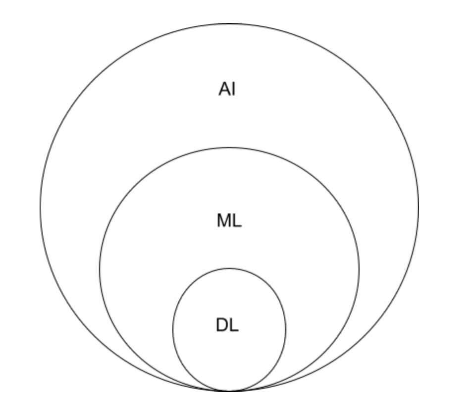
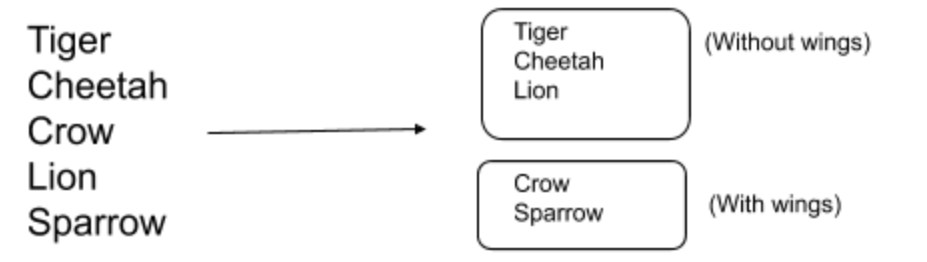
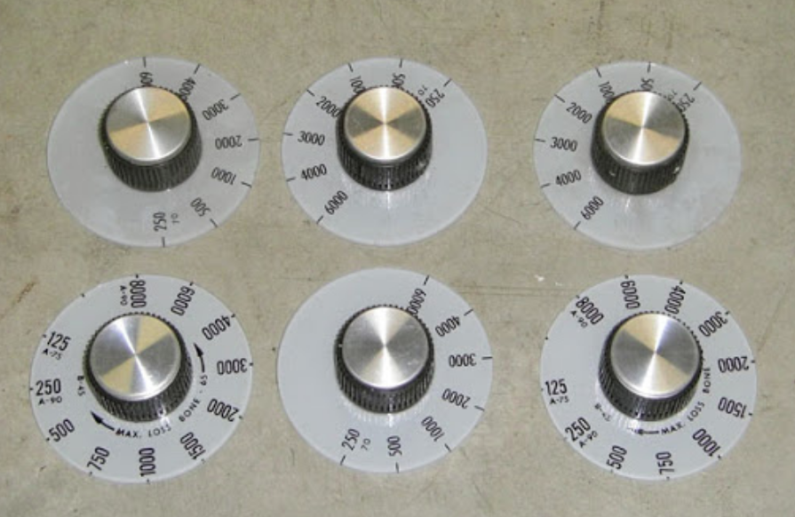

**📠 What is machine learning?**

In a nutshell, it's giving computers the ability to learn without being explicitly programmed. This means that computers can work out for themselves what patterns in data are important and which are not. They can even change their actions according to what is happening in the world around them 🌎

**🌊 So what is deep learning?**
Deep learning is a subset of machine learning which uses artificial neural networks to make machines learn. Artificial neural networks are algorithms that try to mimic the working of the human brain 🧠 

**🤖 Finally, then what is artificial intelligence?**

Machines demonstrating intelligence at the same level as humans, machines thinking like humans think, machines mimicking human behaviour, is artificial intelligence 🙋‍♂️

**👨‍🏫 Now, how do we teach machines?**

There are two main ways in which we can teach machines: 
Supervised Learning: We show the machine all of the input data. The data is properly labelled, and the machine knows what classes of data there might be. The machine can now learn the properties of each class, and given any input predict which class it might belong to. For example, you have a machine learning based weather prediction system. Given the trends in weather over the past few years, you can train a model to accept the conditions of a particular day and make it predict the weather for the next day. 
Unsupervised Learning: In supervised learning, we have fixed classes of data, and there will be a right and a wrong answer. Contrary to this, in unsupervised learning, the algorithm will try to find patterns in data, and will try to cluster similar types of data together without actually knowing the real label. For example, this is what an unsupervised learning technique would do:
You have the following data: tiger, cheetah, crow, lion, sparrow. The algorithm will just try to find and make clusters of similar data.

There is a third class of learning called semi-supervised learning as well. This is as the name suggests, a cross over between the two main techniques described above. A small amount of the input  will be labeled, and a large portion of it will be unlabeled. The algorithm will learn to recognize and classify data based on the limited amount of labelled training data it has.   

Another way of dividing ML algorithms is parametric and non-parametric algorithms. 
Firstly, what are parameters?
Parameters are the properties of the data which make it stand out that a model is trained on.   

Simply put, parametric algorithms are those in which the number of parameters is fixed, while in non-parametric algorithms, it varies depending on the data. 

Now we can combine all these 4 classes, which gives us supervised parametric learning, unsupervised parametric learning, supervised non-parametric learning, and unsupervised non-parametric learning. 

Let’s take a small peek into how a model will actually learn.
When we talk about training a model, we actually talk about the model weights. Imagine each model having a set of knobs corresponding to each parameter. To make it simpler imagine the weights to be knobs on a machine. Every time you have to make the model better, you will adjust the knobs so that they can understand patterns better as we keep giving it more input data.

|  |
|---|
| Adjust knobs to keep adjusting model weights |

**🎯 Let’s talk a bit more about parametric learning**

A naive way of describing parametric learning would be to say it’s a trial and error based method. For example, you have several photos of dogs, and you are given another photo(the input) and told to match it with the existing photos. You’ll keep comparing it with each and every photo until you find the correct one. This is trial and error based. 

Now let’s go a bit deeper into supervised parametric learning as well which is something I’ll talk about in further blogs as well. 
There are 3 major steps to supervised parametric learning: 
Prediction: The first step would be to give the input to the algorithm and get it’s prediction on the data. You’ll be thinking how did we jump into prediction directly without training the model at all. Therein comes  the second step. 
Comparison with the true value: Now we’ll compare the predicted value of the algorithm with the true value that we should have gotten. In this step we’ll calculate the error between the predicted and actual value. Unless the error is 0, we’ll proceed to the next and final step. 
Learning the pattern: In this step, we will do the “training”. We will adjust the model weights(turn the knobs) such that the prediction would have been closer to the true value.

From the next blog, we’ll get into the details about how these 3 steps actually work and get our hands dirty with some code as well. 
