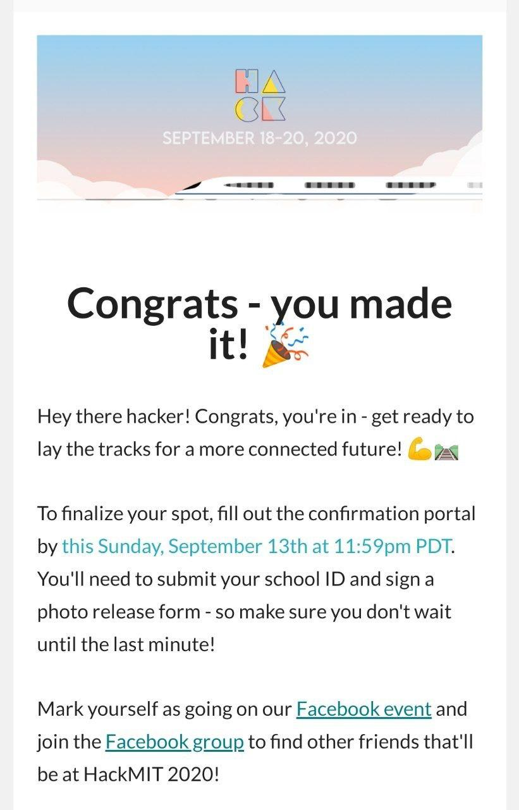

HackMIT is the annual hackathon held by the Massachusetts Institute of Technology. I applied for HackMIT last year, in 2019 too, but didn't get selected for it at that 
time. This time my team members and I applied in the second selection round. We didn't expected to make it through since lot of people apply for this and it is a 
highly selective competition. But one fine day I was just randomly checking my academic email, the one with which I applied to HackMIT, and I was blown away to see that 
my team had made it through 🥳🎉

I was teamed up with my fellow members from [amFOSS](amfoss.in), [Abhijit](https://twitter.com/abhijitramesh2k), [Harshith](https://twitter.com/harshith1304), and
[Vishwaak](https://twitter.com/vishwaakchandra) 🔥🔥 

This year due to the pandemic, HackMIT was held completely online. But the organizers made it a memorable experince nevertheless. We had several fireside chats, workshops
by IBM, Facebook, CMT, etc., along with several mini events like Escape Room, Typeracer, etc 🤪

One of the best efforts made by the HackMIT team to allow participants to interact with each other was making the HackMIT Playground. This was a virtual city in which
all participants could roam around, visit sponsor booths, hacker arena, and a lot of other wonderful stuff. There was even a HackMIT club over there with a disco in it. 
Me and the boys had fun dancing over there using the moves that our sprites had. (Achivement unlocked, visit a club with a disco 😉)

Well, this was the part which was fun. Now comes the part which was the best. The hacking period. The toughest thing was to choose an idea to work on. In the end, we
decided to work on an application to help people with deaddcition. People who might have beeen trying their best to recover, have suddenly been plunged into staying
at their homes all day and in a lot of cases with little to no support. We belive no one should face such hardships, and this is the problem we aim to solve with 
Dexify. Dexify is a deaddiction and a community mental health tracking app. It has the ability to monitor one's mood and day to day acitvities. It does not just stops
with tracking it but also helps to improve the mood of the user and keep them positive and motivated 😃

**What made our project tick**

- We provide the entire service in form of a flutter application that can run on both Android and iOS devices 📱
- For the chat feature, we have built a separate backend which ensure complete security using Google's Firebase services 💬
- Mood analysis is done by the IBM Watson Tone Analyser API which analyse the sentiment of the user input and returns the result promptly allowing us to display 
relavant quotes 💪

**Our techstack**

- Flutter
- GraphQL
- sqflite
- Firebase
- IBM Watson Tone Analyser
- Typescript

|  |  |  | 
|---|---|---|
|  |  |  |

Our project didn't win any prize, but nevertheless it was a great 36 hour experince with a total of around 4-5 hours of sleep in between 😵 

You can view more about the project we made over here:

- Application repo: [dexify](https://github.com/Fireboltz/dexify)
- Backend repo: [dexiy-backend](https://github.com/Fireboltz/dexify-backend)
- Our website: [website](https://dexify.netlify.app/)

We hope to keep working on this idea, and also welcome any contributions to it ✨

Thanks HackMIT for this wonderful chance and we look forward to participate in more such hackathons in the future! 💻😋