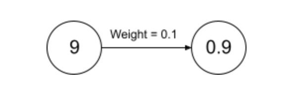
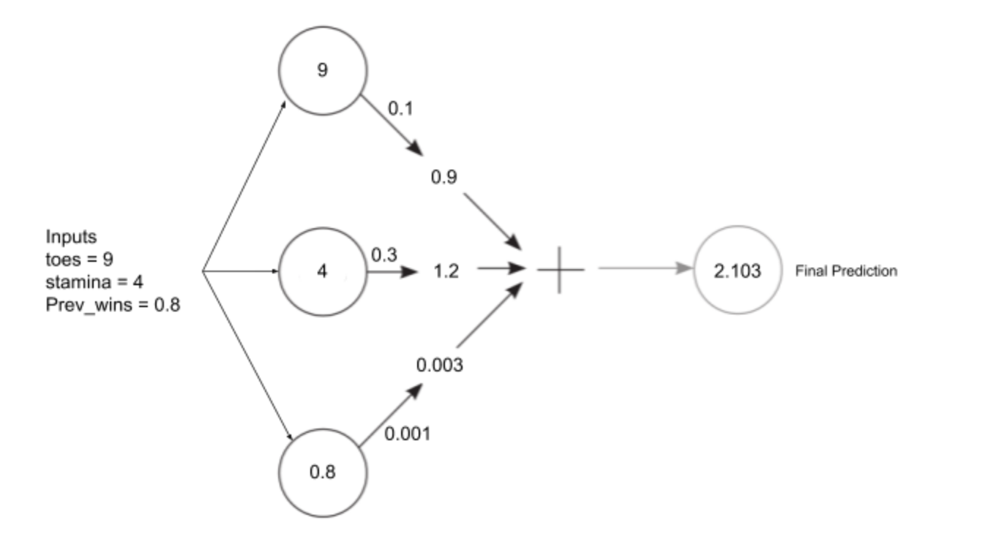

In this blog, we’ll discuss how a neural network makes predictions. 

**🛠️ What are the components that a neural network will always have?**

Weights, this is what the final model is composed of, the input data, this is what is processed by the network weights, and finally the prediction, the value a network will give as the output that might then be used to update the weights. 

Now  that we know the building blocks of a neural network 🧱, without further ado, let’s build our first neural network. Let’s assume that the neural network will be predicting whether a human(the input) is fit to participate in a marathon or not.

Some features that influence the participation in a marathon might be: 
Number of toes
Stamina
Number of previous wins

Let’s start with the most basic neural network which will just take a single input and make a  prediction. 

```python
weight = 0.1
def neuralNetwork(input, weight):
	prediction = input * weight
	return prediction

number_toes = [9, 10, 8.5, 9.5]
for i in number_of_toes:
	input = i
	pred = neural_network(input, weight)
	print(pred)
```

Output:
```
0.9
1.0
0.8500000000000001
0.9500000000000001
```

**💣What just happened here?**

We created a simple neural network which multiplies the input by a weight. As we learned before, the weight is the property which determines the output. This is basically what every neural network will be doing under the hood for making predictions. 
What happened here was simply that each input(number of toes) was multiplied by its weight(the effect number of toes would have on the ability of a human to take  part in the marathon), and based on that, a prediction was made. 



But in most cases, we can’t make the final prediction with just one set of inputs, we might require the other factors as well,in this case, stamina, and previous wins. So let’s take a look at how this would be done. 

The first question that comes here would be, how will the outputs of predictions from multiple inputs with multiple weights be combined into a single  prediction. The answer is simple, for each input, we’ll simply sum up the output of the product of the weights and inputs. If you think about  it, this  is simply the dot product between two matrices. 
A simple example:
```python
weights = [0.1, 0.3, 0.001]
number_toes = [9, 2]
stamina = [4, 3] #stamina on a scale of 1-5
prev_wins = [0.8, 0.3] #as a percentage
```
The first input here would be, `number_toes[0]`, `stamina[0]`, `prev_wins[0]`, which will be multiplied by `weights[0]`, `weights[1]`, `weights[2]` and the sum of all products for the first input will be the prediction for the first input. 

```python
pred1 = number_toes[0] * weights[0] + stamina[0] * weights[1] + prev_wins[0] * weights[2]
pred2 = number_toes[1] * weights[0] + stamina[1] * weights[1] + prev_wins[1] * weights[2]
```



Now let’s look at the complete code for making predictions with multiple inputs, with each input associated with a particular weight. 

```python
def wSum(a,b):
	output = 0
	for i in range(len(a)):
		output += a[i] * b[i]
	return output

def neuralNetwork(input, weights):
	pred = wSum(input, weights)
	return pred
	
weights = [0.1, 0.3, 0.001]
number_toes = [10, 9.5, 9, 8]
stamina = [4, 4.8, 3.4, 2.3]
prev_wins = [0.85, 0.3, 0.1, 0.9]

for i in range(len(number_toes)):
	input = [number_toes[i], stamina[i], prev_wins[i]]
	pred = neuralNetwork(input, weights)
	print(pred)
```

*A small note here: Neural networks can have negative weights and can predict negative values as well*

For the final step in this blog, we'll just convert the code we wrote into numpy. Numpy is a python library which makes mathematical computation very fast and efficient, and has a lot of inbuilt functions which reduces the boilerplate code we just wrote by a lot. 

Installing numpy: 
```bash
pip install numpy
```

The numpy code: 
```python
import numpy as np #importing numpy

def neural_network(input, weights): # a single function to replace all the previous code
	pred = input.dot(weights) #finding the dot product
	return pred

weights = np.array([0.1, 0.3, 0.001]) # creating numpy arrays
number_toes = np.array([10, 9.5, 9, 8])
stamina = np.array([4, 4.8, 3.4, 2.3])
prev_wins = np.array([0.85, 0.3, 0.1, 0.9])

for i in range(len(number_toes)):
	input = np.array([[number_toes[i], stamina[i], prev_wins[i]]])
	pred = neural_network(input,weights)
	print(pred)
```

Now neural networks can take in a single input and give out a single prediction, or take in multiple inputs, and give out a single prediction. Neural networks
can also give out multiple outputs with single or multiple inputs. We can also stack neural networks and make predictions on predictions. I will dive into this 
for the next post.  
