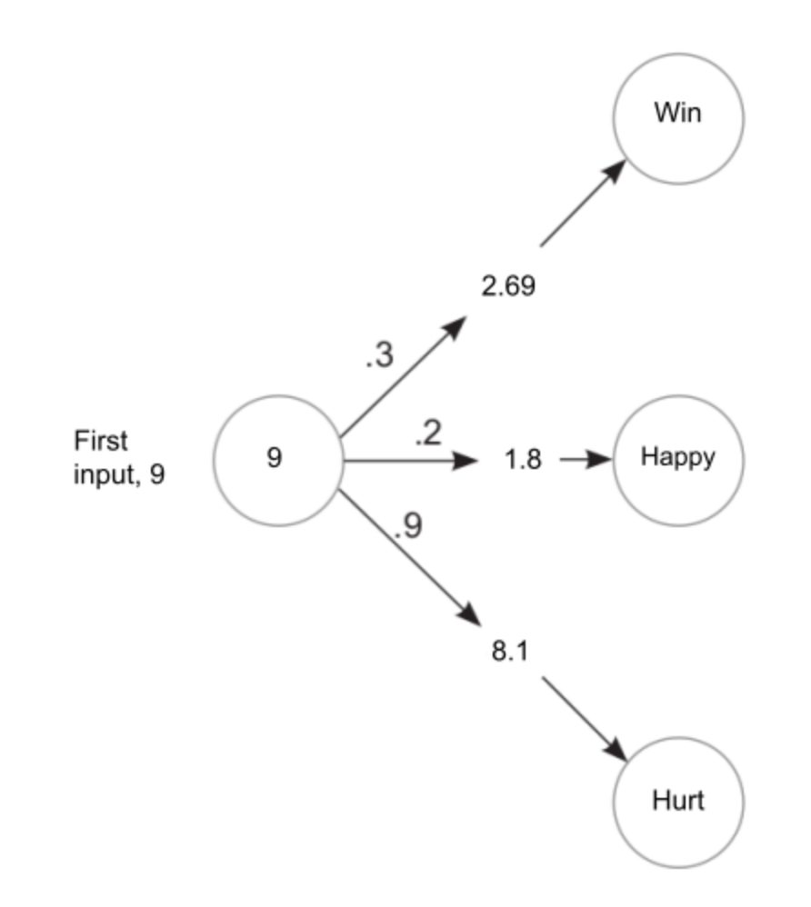
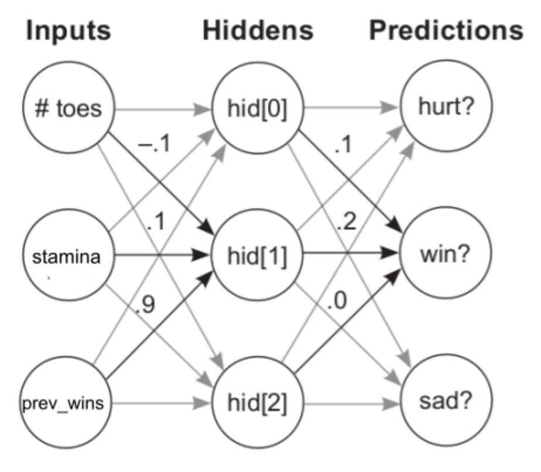

In this blog we’ll discuss making predictions having multiple outputs. 

Let’s start with the simplest case of having a single input, with multiple outputs. Having multiple outputs means that we’re making multiple predictions. The important thing to note here is that each of the different outputs are completely independent of each other. This is in contrast with having multiple inputs with a single output in which each input affects the final prediction. Each different output here can be considered as an independent component of the neural network. 

For example, let’s consider the case we took in the previous post about predicting whether a person is capable of taking part in a marathon or not. By including a few weights, we can predict whether the person is hurt, or happy or sad as well. Let’s take a look into the code for for this:
```python
def neural_network(input, weights):
	pred = ele_mul(input,weights)
	return pred

def ele_mul(number,vector):
	output = [0,0,0]
	for i in range(len(vector)):
		output[i] = number * vector[i]
	return output
	
weights = [0.3, 0.2, 0.9] #weight 1 is for the winning prediction, weight 2 is for predicting whether an athlete is happy or not and weight 3 is for predicting whether an athlete is hurt
n_toes = [9, 8, 9.5, 10]
for i in n_toes:
	input = i
	pred = neural_network(input, weights)
	print(pred)
```

We get the following output on executing the code:
```
[2.6999999999999997, 1.8, 8.1]
[2.4, 1.6, 7.2]
[2.85, 1.9000000000000001, 8.55]
[3.0, 2.0, 9.0]
```



So we saw how we can use a single input with different weights to get different predictions completely unrelated to each other. 

As seen in previous cases, in any real word problem, we won’t get just a single input. So as the next step of making predictions, lets see how to make predictions with multiple inputs which will give us multiple outputs. 

Let’s write the code for this to understand what happens here and how it works. 

```python
def w_sum(a,b):
	output = 0
	for i in range(len(a)):
		output += (a[i] * b[i])
	return output

def vect_mat_mul(vect,matrix):
	output = [0,0,0]
	for i in range(len(vect)):
		output[i] = w_sum(vect,matrix[i])
	return output
	
def neuralNetwork(input, weights):
	pred = vect_mat_mul(input, weights)
	return pred

	   #toes #wins  #stamina
weights = [[0.1, 0.1, -0.3], # win
	   [0.1, 0.2, 0.0], # happy
	   [-0.0, 1.3, 0.1]] # hurt
	   
number_toes = [10, 9.5, 9, 8]
stamina = [4, 4.8, 3.4, 2.3]
prev_wins = [0.85, 0.3, 0.1, 0.9]

for i in range(len(number_toes)):
	input = [number_toes[i], stamina[i], prev_wins[i]]
	pred = neuralNetwork(input, weights)
	print(pred)

```

Output: 
```
[1.145, 1.8, 5.285]
[1.34, 1.9100000000000001, 6.2700000000000005]
[1.21, 1.58, 4.43]
[0.76, 1.26, 3.0799999999999996]
```
So here we had 3 different inputs(as we’ve already seen in the previous blog), along with 3 different categories of weights. We have different weight vectors here, which together make up the weight matrix. Each weight vector has weights corresponding to the inputs. And each weight vector corresponds to a different prediction by itself, such as winning, happy or hurt. This is how we can take in multiple inputs, and have  multiple outputs. For each output, we’re basically performing a weighted sum of the inputs with the corresponding weights. 

Now, a neural network might have more layers. Each layer will make predictions on the predictions made by the previous layer. Simply, this can be imagined as several neural networks stacked upon each other. So as a final step of making predictions, let’s see how we can make predictions on predictions. 

```python
import numpy as np
		 # toes stamina wins
ih_wgt = np.array([[0.1, 0.2, -0.1], # hid[0]
		   [-0.1,0.1, 0.9], # hid[1]
		   [0.1, 0.4, 0.1]]).T # hid[2]
		   
		  # hid[0] hid[1] hid[2]		  
hp_wgt = np.array([[0.3, 1.1, -0.3], # hurt
		   [0.1, 0.2, 0.0], # win
		   [0.0, 1.3, 0.1] ]).T # happy
		   
weights = [ih_wgt, hp_wgt]

def neuralNetwork(input, weights):
	hid = input.dot(weights[0])
	pred = hid.dot(weights[1])
	return pred

number_toes = np.array([10, 9.5, 9, 8])
stamina = np.array([4, 4.8, 3.4, 2.3])
prev_wins = np.array([0.85, 0.3, 0.1, 0.9])

for i in range(len(number_toes)):
	input = np.array([number_toes[i], stamina[i], prev_wins[i]])
	pred = neuralNetwork(input, weights)
	print(pred)
```

Output: 
```
[-0.1095  0.2045  0.483 ]
[-0.526  0.148  0.03 ]
[-0.727  0.063 -0.384]
[0.072 0.165 0.493]
```

So here we have the initial set of weights, along with a second set of weights that will be used to perform the weighted sum on the predictions made by the first set of weights. Let’s take a look at a diagram to understand this better. The second set of weights are called the hidden weights because they belong to a “hidden layer” of the network. The intermediate layer of a network, i.e., the layers between the input and output layers are generally referred to as the hidden layers. 



First we did what we always do, perform the weighted sum on the first set of inputs using the initial weights. Then with the predictions we got from the initial weights, we performed the same weighted sum again with the hidden weights to get the final predictions. In neural networks, we can keep on stacking layers like this to make predictions on predictions in order to get the final output. 

To summarize the last 2 blogs, we basically learned that in order to make a prediction, a neural network will perform repeated weighted sums on the input. 
In the next blog, we will look into how a network will actually learn to make correct predictions by looking into an algorithm called gradient descent. 