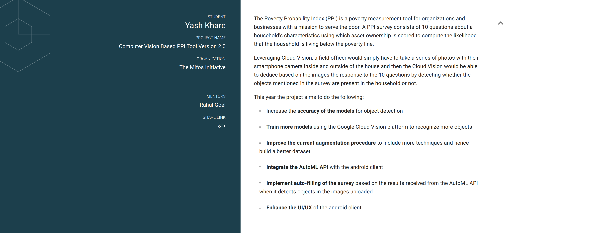

May 4, 2020

11:32PM IST

I get a Gmail notification.

***GSoC 2020: Congratulations, your proposal with The Mifos Initiative has been accepted!***

Yes! My proposal for Google Summer of Code 2020 got accepted. 

[Google Summer of Code(GSoC)](https://summerofcode.withgoogle.com/) is a program organized by Google to promote development of open source software. I had been introduced to 
GSoC in my first year of college. Since that time I had been very interested in this program. I applied for GSoC in my first year too, but unfortunately my organization, FOSSASIA,
did not get the expected number of slots. As a result, the projects I submitted a proposal for were not given any slots and I wasn\`t selected for GSoC\`19. 

Since I was really interested, I decided to try again the next year for GSoC\`20. I started preparing for GSoC\`20 from January, and initially started contributing to an organization called [Kiwix](https://www.kiwix.org/en/). I worked on the [Kiwix Android App](https://github.com/kiwix/kiwix-android) which is basically
a Wikimedia Offliner, that also makes available other content such as TED Talks offline for regions with poor internet connectivty. After sometime, I stumbled across another project in an 
organization called the [Mifos Initiative](https://mifos.org/). The project was [Vision PPI](https://github.com/openMF/ppi-vision). This project caught my attention as it required knowledge of both Computer Vision, 
and Android App Development, the domains in which I have done a lot of work till now. So along with contributing to Kiwix, I decided to work on the Vision PPI project
and submit proposals for both the projects. 

Finally the day of results came, and my work finally paid off. My proposal for the Vision PPI project under the Mifos Initiative got accepted!

[Here](https://summerofcode.withgoogle.com/projects/#4868824286887936) is a link to my project on the GSoC`20 website.

The Vision PPI project has 2 parts: 

- The image classification models trained using Google Cloud AutoML
- The android app which used the AutoML API to upload images from an android phone to the cloud for classification

The Poverty Probability Index (PPI) is a poverty measurement tool for organizations and businesses with a mission to serve the poor.
A PPI survey consists of 10 questions about a household’s characteristics using which asset ownership is scored to compute the likelihood that the household is living below the poverty line.

Leveraging Cloud Vision, a field officer would simply have to take a series of photos with their smartphone camera inside and outside of the house
and then the Cloud Vision would be able to deduce based on the images the response to the 10 questions by detecting whether the objects mentioned in
the survey are present in the household or not.

I will be spending three months from June to August working on this project to improve the accuracy of the models, revamping the android app,
integrating the AutoML API and a feature to fill the surveys automatically. 

Today is the last the of the community bonding period that was from May 4 to May 31. During this time, I got introduced to my project mentors. I started working on
some important parts of the project which needed to be done so that the main work would go with out a hitch. It has a great experience till now!

The coding period officially starts from tomorrow, 1 June 2020.
I am looking forward to an amazing 3 months full of fun, learning and increasing my knowledge and skillset. 

*"Hardwork is like a staircase and luck is like a lift. The lift may sometimes fail but the staircase will always take you to the top."* - I have no idea who said this
but it makes sense to me

